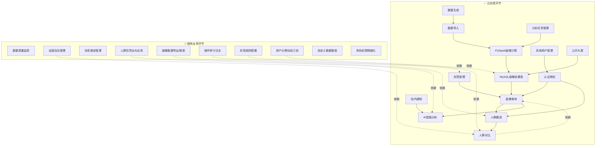
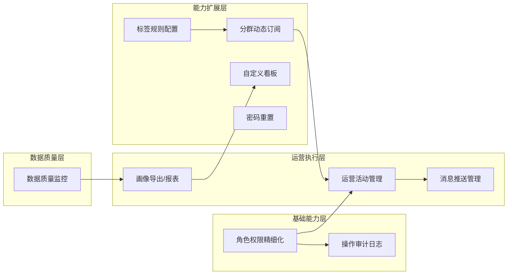
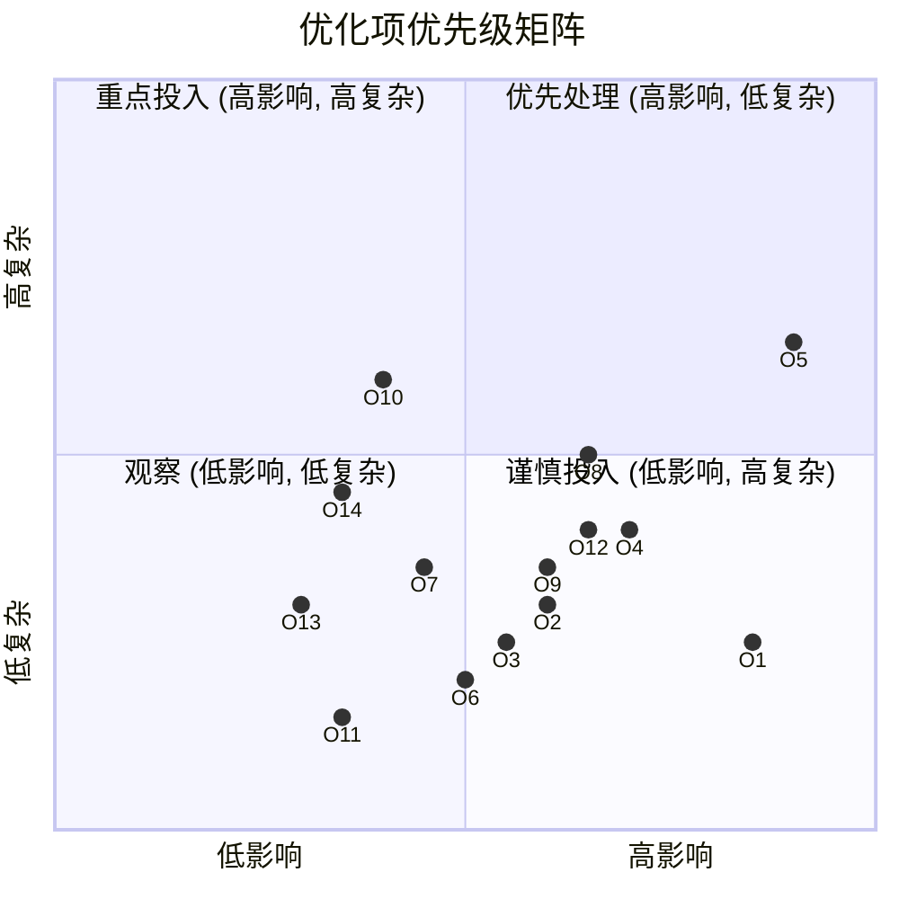
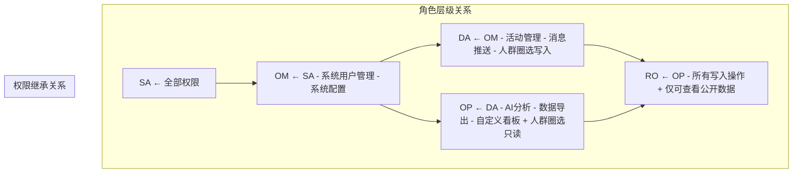
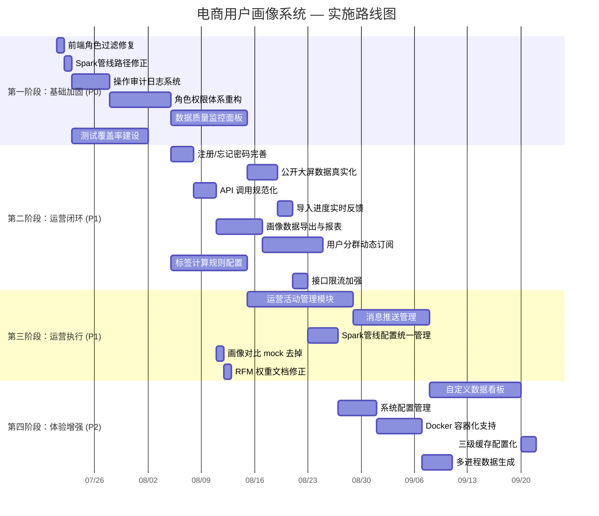

# 电商用户画像系统 — 业务规划与功能设计分析报告

> **文档版本**：v1.0  
> **编制日期**：2026-07-14  
> **编制人**：许清楚（产品经理）  
> **状态**：初稿待评审  
> **关联文档**：project-analysis.md, functional-analysis.md, project-codebase-analysis.md

---

## 目录

1. [封面信息](#1-封面信息)
2. [业务全景图](#2-业务全景图)
3. [模块依赖关系矩阵](#3-模块依赖关系矩阵)
4. [缺失业务环节识别](#4-缺失业务环节识别)
5. [新增功能设计](#5-新增功能设计)
6. [现有功能优化建议](#6-现有功能优化建议)
7. [完整业务闭环覆盖评估](#7-完整业务闭环覆盖评估)
8. [角色权限体系设计](#8-角色权限体系设计)
9. [迁移路径建议](#9-迁移路径建议)
10. [需求优先级排序总表](#10-需求优先级排序总表)

---

## 1. 封面信息

| 项目 | 内容 |
|------|------|
| **系统名称** | 电商用户画像分析系统 |
| **项目代号** | ecommerce-user-profile |
| **当前版本** |  |
| **技术栈** | Spring Boot 3.3.7 + Vue 3 + PySpark |
| **当前状态** | 核心链路已打通（≈75% 完成度），处于可演示但待完善阶段 |
| **报告定位** | 从产品/业务视角梳理完整业务流程，识别差距，规划新增功能和角色权限体系 |

---

## 2. 业务全景图

### 2.1 端到端业务流程总览

```
┌─────────────────────────────────────────────────────────────────────────────────────────────┐
│                                    业务全景：电商用户画像系统                              │
└─────────────────────────────────────────────────────────────────────────────────────────────┘

┌────────── 数据生产流程（Data Production） ──────────┐
│                                                      │
│  Python 数据生成 ──CSV──► 数据导入 ──► MySQL 业务表     │
│  (generate_data.py)    (Orchestrator)   (7张表)      │
│       │                    │                        │
│       └────────────────────┘                        │
│                                                      │
│  PySpark 画像计算 ──► MySQL 画像结果表 (4张表)         │
│  (本地 PySpark)       (只读)                          │
└──────────────────────────────────────────────────────┘
         │                      ▲
         ▼                      │
┌────────── 运营分析流程（Operation Analysis） ─────────┐
│                                                      │
│  用户登录 ──► 查看画像概览 ──► 查看分层/标签分布         │
│       │                      │                       │
│       ▼                      ▼                       │
│  用户画像列表/详情    AI 自然语言分析                   │
│       │                      │                       │
│       ▼                      ▼                       │
│  人群圈选（12字段） ──► A/B 画像对比 (5维)              │
│       │                                               │
│       ▼                                               │
│  人群包管理 ──► 导出/应用 (当前缺失)                    │
└──────────────────────────────────────────────────────┘
         │
         ▼
┌────────── 运营管理流程（Operation Management） ────────┐
│  【当前缺失 → 待新增】                                  │
│                                                      │
│  运营活动管理 ──► 消息推送 ──► 活动效果分析               │
│  数据质量监控 ──► 标签规则配置 ──► 画像导出报表           │
│  用户分群动态订阅 ──► 自定义数据看板                     │
└──────────────────────────────────────────────────────┘
         │
         ▼
┌────────── 系统管理流程（System Management） ──────────┐
│                                                      │
│  系统用户管理 ──► 标签字典管理 ──► 分析任务管理           │
│       │                      │                       │
│       ▼                      ▼                       │
│  登录审计日志     操作审计日志 (当前缺失)                │
│       │                      │                       │
│       ▼                      ▼                       │
│  系统配置管理     数据导入/生成管理                      │
└──────────────────────────────────────────────────────┘
```

### 2.2 数据生产流程（已实现）

```
┌──────────────┐   CSV    ┌──────────────────┐   JDBC批量   ┌──────────────────┐
│  generate_   │ ────────►│  DataImport      │ ──────────►│ MySQL 业务表      │
│  data.py     │          │  Orchestrator    │            │ (7张业务表)       │
│ (Python)     │          │                  │            │                   │
│  --users=N   │          │  1. 路径遍历防护  │            │ ecommerce_user   │
│  --orders=N  │          │  2. 外键依赖排序  │            │ product          │
│  --seed=S    │          │  3. 批量插入      │            │ sales_order      │
└──────────────┘          └──────────────────┘            │ ...              │
       │                                                    └────────┬────────┘
       │  CSV 同时保留供 Spark 使用                                 │
       ▼                                                           ▼
┌──────────────────┐                                    ┌──────────────────┐
│ 数据生成 → CSV   │ ──► 清洗 ──► 聚合 ──► 画像产出       │ PySpark 画像计算  │
│ (generate_data)  │                                    │ (本地模式)      │
└──────────────────┘                                    │  Phase1-5       │
                                                        │  RFM NTILE(5)   │
                                                        │  4类标签         │
                                                        └────────┬────────┘
                                                                 │ JDBC truncate+overwrite
                                                                 ▼
                                                        ┌──────────────────┐
                                                        │ MySQL 画像结果表  │
                                                        │ (4张只读表)      │
                                                        │  user_profile_   │
                                                        │  summary         │
                                                        │  user_segment    │
                                                        │  user_profile_   │
                                                        │  tag             │
                                                        │  ads_user_rfm    │
                                                        └──────────────────┘
```

**数据生产流程的关键依赖链**：

```
生成(CSV) → 导入(MySQL业务表) → Spark计算(画像结果表) → API查询 → 前端展示
```

### 2.3 运营分析流程（已实现 + 待补充）

```
┌──────────────┐
│  登录/认证    │  ──JWT──►  403/401 ← 角色不足时
│  (Auth)      │
└──────┬───────┘
       │ 已实现
       ▼
┌──────────────┐     ┌──────────────────┐     ┌──────────────────┐
│  画像概览     │────►│ 分层分布查看      │────►│ 标签分布分析      │
│  KPI 4项     │     │ 饼图/环形图       │     │ 柱状图           │
│  总用户/已    │     │ 5类价值分层       │     │ 4类标准标签       │
│  画像/高价    │     │                  │     │                  │
│  值/消费额    │     └──────────────────┘     └──────────────────┘
└──────┬───────┘
       ▼
┌──────────────┐     ┌──────────────────┐     ┌──────────────────┐
│  画像列表     │────►│ 画像详情          │────►│ AI 智能分析       │
│  分页/关键字  │     │ 消费/行为/标签    │     │ 自然语言查询      │
│  分层筛选     │     │ 时间线            │     │ SQL 白名单安全    │
└──────┬───────┘     └──────────────────┘     └──────────────────┘
       ▼
┌──────────────┐     ┌──────────────────┐     ┌──────────────────┐
│  人群圈选     │────►│ A/B 画像对比      │────►│ 人群包管理        │
│  12字段动态   │     │ 5维对比          │     │ 保存/列表/更新    │
│  实时预估     │     │ 性别/年龄/分层    │     │ 软删除            │
│  AND/OR 逻辑  │     │ 消费/品类偏爱     │     │                  │
└──────────────┘     └──────────────────┘     └──────┬───────────┘
                                                      │
                                            ┌─────────▼──────────┐
                                            │  ❌ 缺失环节        │
                                            │                    │
                                            │ 1. 人群包导出CSV    │
                                            │ 2. 人群包推送至活动  │
                                            │ 3. 人群包动态刷新    │
                                            │ 4. 人群包对比报告导出│
                                            └────────────────────┘
```

### 2.4 系统管理流程（已实现 + 待补充）

```
┌────────────────────────────────────────────────────────────────────┐
│                        系统管理流程                                  │
└────────────────────────────────────────────────────────────────────┘

┌──────────────┐     ┌──────────────────┐     ┌──────────────────┐
│  系统用户管理  │────►│ 登录审计日志      │────►│ 标签字典管理      │
│  CRUD         │     │ 成功/失败记录     │     │ CRUD + 启停      │
│  启停控制      │     │ 分页查询          │     │                  │
│  角色分配      │     │                  │     │                  │
└──────────────┘     └──────────────────┘     └──────────────────┘

┌──────────────┐     ┌──────────────────┐     ┌──────────────────┐
│  数据导入管理  │────►│ 数据生成管理      │────►│ 分析任务管理      │
│  上传/预览/   │     │ 参数配置/种子     │     │ Pending→Running  │
│  触发导入     │     │ 一键生成          │     │ →Succeeded/Failed│
│  状态轮询     │     │ 自动导入          │     │ 超时30min终止     │
└──────────────┘     └──────────────────┘     └──────┬───────────┘
                                                      │
                                            ┌─────────▼──────────┐
                                            │  ❌ 缺失环节        │
                                            │                    │
                                            │ 1. 操作审计日志     │
                                            │ 2. 系统配置管理     │
                                            │ 3. 数据质量监控     │
                                            │ 4. Spark管线配置    │
                                            │ 5. Docker/CI-CD    │
                                            └────────────────────┘
```

### 2.5 缺失业务环节总览（Mermaid）



---

## 3. 模块依赖关系矩阵

### 3.1 模块间输入/输出关系

| # | 模块 | 输入来源 | 输出目标 | 关键数据 |
|---|------|---------|---------|---------|
| 1 | 数据生成模块 | 用户参数配置 | → CSV 文件（→MySQL） | 7张CSV: user, product, order, behavior |
| 2 | 数据导入模块 | CSV 文件 | → MySQL 业务表（7张） | JDBC批量写入，含外键依赖排序 |
| 3 | 画像计算模块 | CSV | → 画像汇总表 | 清洗→聚合→分层→标签（PySpark 本地管线） |
| 4 | 画像计算引擎 | MySQL业务表 | → MySQL画像结果表（4张） | RFM分层 + 4类标签 + 指标汇总 |
| 5 | 画像查询模块 | MySQL画像结果表 | → REST API → 前端 | 概览/分布/列表/详情（三级缓存） |
| 6 | 人群圈选模块 | MySQL业务表 + 画像结果表 | → 前端圈选结果/人群包 | 12字段动态SQL + 实时预估 |
| 7 | 人群对比模块 | 人群包ID → 数据查询 | → 5维对比图表 | A/B人群多维交叉分析 |
| 8 | AI 智能分析模块 | MySQL业务表 + 画像结果表 | → SSE流式回答 | DeepSeek/Mock + SQL白名单 |
| 9 | 标签管理模块 | 人工录入 | → 标签字典表（profile_tag_definition） | 标签元数据CRUD |
| 10 | 分析任务管理模块 | 任务创建请求 | → 进程调用 Spark | 3类任务: PROFILE/DATA_IMPORT/DATA_GENERATE |
| 11 | 认证授权模块 | 注册/登录请求 | → JWT Token | Spring Security + BCrypt |
| 12 | 系统管理模块 | Admin 操作 | → sys_user / sys_login_log | 用户CRUD + 登录审计 |
| 13 | 站内通知模块 | 事件触发 | → 通知表 → 前端轮询 | AI完成/任务完成通知 |
| 14 | 公开可视化大屏 | MySQL画像结果表 | → 匿名ECharts图表 | 7图表KPI大屏 |

### 3.2 数据流转依赖图

```
                      ┌──────────────────────────────────────────────┐
                      │              用户交互层                       │
                      │  ┌─────┐ ┌──────┐ ┌─────┐ ┌──────┐ ┌─────┐  │
                      │  │仪表盘│ │画像  │ │人群  │ │AI    │ │公开  │  │
                      │  │概览  │ │详情  │ │圈选  │ │分析  │ │大屏  │  │
                      │  └──┬──┘ └──┬───┘ └──┬──┘ └──┬───┘ └──┬───┘  │
                      │     │       │        │       │        │      │
                      └─────┼───────┼────────┼───────┼────────┼──────┘
                            │       │        │       │        │
                      ┌─────▼───────▼────────▼───────▼────────▼──────┐
                      │           API 网关层 (JWT + Spring Security)   │
                      │    /api/v1/profiles/** /admin/** /public/**   │
                      │    /ai/** /notifications/**                   │
                      └─────┬───────┬────────┬───────┬────────┬──────┘
                            │       │        │       │        │
              ┌─────────────┼───────┼────────┼───────┼────────┼─────────────┐
              │             │       │        │       │        │             │
              ▼             ▼       ▼        ▼       ▼        ▼             │
┌─────────────────────────┐                                                │
│     MySQL 数据库         │                                                │
│                         │                                                │
│  ┌───────────────────┐  │   ┌──────────────────┐                         │
│  │  业务数据域         │  │   │  画像结果域       │                         │
│  │  ecommerce_user   │  │   │  user_profile_   │                         │
│  │  product          │──┼──►│  summary          │                         │
│  │  sales_order      │  │   │  user_segment     │                         │
│  │  ... (7张)        │  │   │  user_profile_tag  │                         │
│  └────────┬──────────┘  │   │  ads_user_rfm     │                         │
│           │             │   └────────┬─────────┘                         │
│           │             │            │                                   │
│  ┌────────▼──────────┐  │            │                                   │
│  │  系统管理域         │  │            │                                   │
│  │  sys_user         │  │            │                                   │
│  │  sys_login_log    │  │            │                                   │
│  │  profile_tag_     │  │            │                                   │
│  │  definition       │  │            │                                   │
│  │  spark_analysis_  │  │            │                                   │
│  │  task             │  │            │                                   │
│  └───────────────────┘  │            │                                   │
│                         │            │                                   │
└─────────────────────────┘            │                                   │
         │                             │                                   │
         │ 数据写入                      │ 数据读取                          │
         ▼                             ▼                                   │
┌──────────────────────────────────────────────────────┐                   │
│                  大数据加工层                          │                   │
│                                                      │                   │
│  ┌────────────┐  ┌─────────────────────────────────┐  │                   │
│  │ Python     │  │  PySpark 画像计算                │  │                   │
│  │ 数据生成   │  │  ┌─────────────────────────┐    │  │                   │
│  │ generate_  │──►│  │ Phase1: CSV读取        │    │  │                   │
│  │ data.py    │  │  │ Phase2: DWD清洗(去重/校验)│    │  │                   │
│  └────────────┘  │  │ Phase3: DWS汇总(用户指标) │    │  │                   │
│                  │  │ Phase4: RFM+分层+标签     │    │  │                   │
│                  │  │ Phase5: JDBC写入MySQL    │    │  │                   │
│                  │  └─────────────────────────┘    │  │                   │
│                  └─────────────────────────────────┘  │                   │
│                                                      │                   │
│                                                      │                   │
│                                                      │                   │
└──────────────────────────────────────────────────────┘                   │
                                                                            │
┌──────────────────────────────────────────────────────────────────────────┘
│
▼
┌──────────────────────────────────────────────┐
│         外部依赖 / 基础设施                     │
│  • 文件系统: generated-data/ CSV 存储          │
│  • 环境: Python 3 + PySpark + Java 17         │
│  • 环境: Python 3 + PySpark + Java 17         │
│  • 可选: DeepSeek API Key (AI分析)            │
└──────────────────────────────────────────────┘
```

---

## 4. 缺失业务环节识别

### 4.1 缺失环节清单

| # | 缺失环节 | 所属流程 | 缺失原因 | 影响范围 | 补充优先级 |
|---|---------|---------|---------|---------|-----------|
| G1 | **数据质量监控** | 数据生产 | 完全未实现 | 数据可靠性无法验证，脏数据影响画像准确性 | **P0** |
| G2 | **操作审计日志** | 系统管理 | 仅实现了登录审计 | 无法追溯操作变更，不满足合规审计要求 | **P0** |
| G3 | **运营活动管理** | 运营管理 | 完全未实现 | 人群圈选后无法落地到实际运营活动中 | **P1** |
| G4 | **消息推送管理** | 运营管理 | 完全未实现 | 无触达用户的能力，运营无法执行 | **P1** |
| G5 | **画像导出/报表** | 运营分析 | 完全未实现 | 无法将画像数据导出为离线分析或汇报材料 | **P1** |
| G6 | **标签计算规则配置** | 画像计算 | 标签规则硬编码在Spark | 运营人员无法自定义标签规则，扩展性差 | **P1** |
| G7 | **用户分群动态订阅** | 运营分析 | 完全未实现 | 人群包为静态快照，无法自动更新 | **P1** |
| G8 | **自定义数据看板** | 数据分析 | 完全未实现 | 用户无法按需配置关注的指标和图表的 | **P2** |
| G9 | **角色权限精细化** | 系统管理 | 仅有User/Admin两角色 | 职责不清晰，安全风险，不满足分级管理需求 | **P0** |
| G10 | **忘记密码/密码重置** | 认证授权 | 前端空壳，未对接API | 用户体验差，影响可用性 | **P1** |
| G11 | **容器化与CI/CD** | 运维部署 | 完全未实现 | 部署门槛高，缺乏自动化 | **P2** |
| G12 | **系统监控与告警** | 运维部署 | 完全未实现 | 无法及时发现系统异常 | **P2** |

### 4.2 各环节依赖关系



---

## 5. 新增功能设计

### 5.1 功能总览

| # | 功能名称 | 所属模块 | 优先级 | 复杂度 | 预估人天 |
|---|---------|---------|-------|-------|---------|
| F1 | 数据质量监控面板 | 数据生产 | **P0** | 高 | 10-15 |
| F2 | 操作审计日志系统 | 系统管理 | **P0** | 中 | 5-8 |
| F3 | 运营活动管理模块 | 运营管理 | **P1** | 高 | 12-18 |
| F4 | 消息推送管理 | 运营管理 | **P1** | 中 | 8-12 |
| F5 | 画像数据导出与报表 | 运营分析 | **P1** | 中 | 6-10 |
| F6 | 标签计算规则配置 | 画像计算 | **P1** | 高 | 10-15 |
| F7 | 用户分群动态订阅 | 运营分析 | **P1** | 中 | 8-10 |
| F8 | 自定义数据看板 | 数据分析 | **P2** | 高 | 10-15 |
| F9 | 忘记密码/密码重置 | 认证授权 | **P1** | 低 | 2-3 |
| F10 | 系统配置管理 | 系统管理 | **P2** | 中 | 5-8 |

---

### 5.2 详细功能设计

---

#### F1：数据质量监控面板（P0）

**业务目标**：对数据生产和画像计算的全链路进行质量监控，确保数据的完整性、准确性和一致性。

**功能详情**：

| 子功能 | 说明 | 验收标准 |
|--------|------|---------|
| 数据源质量报告 | 对MySQL业务表各表进行质量检查：空值率、唯一性、数据分布 | 支持按表查看质量评分(0-100)，明细异常记录 |
| 画像结果校验 | 对比画像结果表与原始业务表的数量一致性 | 自动检测记录数偏差 >5% 时告警 |
| 管线运行状态 | 展示数据生成/导入/Spark任务的运行历史和成功率 | 支持按时间范围筛选，成功率趋势图 |
| 数据新鲜度指标 | 展示各表最后更新时间，检测管线延迟 | 超过配置阈值（默认24h）时标红告警 |
| 质量规则配置 | 支持配置质量检查规则（阈值、频率、告警方式） | 支持CRUD规则，可启用/禁用 |

**数据流**：
```
质量检查引擎（定时调度）→ 读取MySQL源表和画像表 → 计算质量指标 → 写入质量报告表 → 前端展示 + 告警通知
```

**技术要点**：
- 新增 `data_quality_report` 表存储质量检查结果
- 新增 `data_quality_rule` 表存储质量规则配置
- 后端定时任务 `@Scheduled` 调度质量检查
- 质量异常时触发站内通知

---

#### F2：操作审计日志系统（P0）

**业务目标**：记录所有用户的关键操作行为，满足合规审计和安全追溯需求。

**功能详情**：

| 子功能 | 说明 | 验收标准 |
|--------|------|---------|
| 操作日志记录 | AOP 切面自动记录关键操作（CRUD、导入、计算、圈选等） | 记录操作人、时间、IP、操作类型、请求参数、执行结果 |
| 日志查询 | 按时间范围、操作人、操作类型、模块筛选 | 支持分页查询，支持 CSV 导出 |
| 操作详情查看 | 查看单条操作的完整请求参数和响应 | 敏感字段（密码等）脱敏显示 |
| 异常操作告警 | 检测批量删除、频繁失败等异常行为 | 短时间内 N 次失败操作触发告警 |

**数据流**：
```
用户操作 → AOP切面拦截 → 异步写入 ops_audit_log 表 → 日志查询API → 前端管理
```

**技术要点**：
- 新建 `ops_audit_log` 表
- Spring AOP + 自定义 `@AuditLog` 注解，非侵入式
- 异步写入（`@Async` + 线程池），不影响主流程性能
- 日志保留策略：默认 90 天自动清理

---

#### F3：运营活动管理模块（P1）

**业务目标**：将人群圈选结果落地到实际运营活动中，形成"圈选→活动→推送→效果评估"的完整闭环。

**功能详情**：

| 子功能 | 说明 | 验收标准 |
|--------|------|---------|
| 活动创建/编辑 | 创建运营活动，关联目标人群包，设置活动时间/预算 | 支持选择已有人群包或新建圈选 |
| 活动类型管理 | 支持多种活动类型（促销、优惠券、推送通知等） | 至少支持3种活动类型 |
| 活动状态管理 | 待开始/进行中/已结束/已取消，自动按时间流转 | 状态自动变更，支持手动提前结束 |
| 活动效果统计 | 展示活动的覆盖人数、触达率、转化率等指标 | 至少展示5项效果指标 |
| 活动历史归档 | 已结束活动自动归档，支持查询历史活动 | 归档活动只读可查 |

**数据流**：
```
创建活动 → 关联人群包 → 启动活动 → 触达用户 → 收集效果数据 → 活动结束/归档
```

**技术要点**：
- 新增 `campaign`、`campaign_audience` 表
- 与人群圈选模块的 `audience_package` 通过人群包ID关联
- 效果数据可通过 Spark 离线计算或在线统计（取决于实时性要求）

---

#### F4：消息推送管理（P1）

**业务目标**：提供多渠道的消息推送能力，支持站内信、邮件、短信等触达方式。

**功能详情**：

| 子功能 | 说明 | 验收标准 |
|--------|------|---------|
| 消息模板管理 | 创建和管理消息模板，支持占位符变量 | 支持模板变量替换、预览 |
| 推送任务创建 | 选择消息模板 + 目标人群包 + 推送渠道 | 支持站内信+至少一种外部渠道 |
| 推送任务状态管理 | 待发送/发送中/已完成/部分失败 | 显示发送进度和失败详情 |
| 推送历史查询 | 查看历史推送记录和统计 | 分页查询，支持按渠道/时间筛选 |
| 站内信增强 | 在现有站内通知基础上，支持批量群发 | 支持按人群包批量发送站内信 |

**数据流**：
```
创建推送任务 → 读取人群包用户列表 → 生成个性化消息 → 各渠道发送 → 记录发送结果
```

**技术要点**：
- 新增 `message_template`、`push_task`、`push_record` 表
- 扩展现有 `sys_notification` 表站内信功能
- 外部渠道（邮件/短信）通过策略模式抽象，支持未来扩展

---

#### F5：画像数据导出与报表（P1）

**业务目标**：支持将画像数据和圈选结果导出为离线文件，支持定期生成分析报表。

**功能详情**：

| 子功能 | 说明 | 验收标准 |
|--------|------|---------|
| 画像数据导出 | 将画像列表/详情导出为 CSV/Excel | 支持字段选择、最大行数限制（10万） |
| 人群包导出 | 将圈选结果导出为用户ID列表 | 支持 CSV/Excel 格式 |
| 报表模板管理 | 预定义分析报表模板（周报/月报/活动报告） | 至少3种模板 |
| 定时报表生成 | 按配置自动生成报表并推送 | 支持每日/每周/每月定时生成 |

**数据流**：
```
导出请求 → 异步线程查询数据 → 生成CSV/Excel → 存入文件系统/发送下载链接 → 前端下载
```

**技术要点**：
- 后端使用 EasyExcel / Apache POI 处理 Excel
- 大文件导出使用异步任务 + 下载链接（临时文件 TTL 24h）
- 定时报表集成 Spring `@Scheduled` + 站内通知推送

---

#### F6：标签计算规则配置（P1）

**业务目标**：将标签计算规则从硬编码的 Spark 脚本中解放出来，支持运营人员在界面上自定义标签规则。

**功能详情**：

| 子功能 | 说明 | 验收标准 |
|--------|------|---------|
| 标签规则编辑器 | 可视化配置标签规则：基础属性阈值、行为次数、金额区间等 | 支持条件组合（AND/OR），公式预览 |
| 规则变量管理 | 管理可用的规则变量（字段、指标、聚合函数） | 从数据字典自动同步可用字段 |
| 规则测试运行 | 对配置的规则进行小规模测试计算 | 在 1000 条样本上运行规则并展示结果分布 |
| 规则版本管理 | 标签规则支持版本化，可回溯历史版本 | 每次修改自动生成新版本 |
| 规则生效/生效调度 | 规则修改后触发重新计算 | 支持立即生效、定时生效、手动触发 |

**数据流**：
```
配置标签规则 → 校验规则合法性 → 存储规则定义 → 触发Spark重算 → 更新画像标签结果
```

**技术要点**：
- 新增 `tag_calc_rule`、`tag_calc_rule_version` 表
- 规则定义 JSON 化存储，Spark 脚本新增规则解析器
- 规则测试运行：选择小样本在 Spark 上运行并返回结果摘要

---

#### F7：用户分群动态订阅（P1）

**业务目标**：使人群包从静态快照变为可自动刷新的动态分群，持续跟踪目标用户群的变化。

**功能详情**：

| 子功能 | 说明 | 验收标准 |
|--------|------|---------|
| 分群订阅配置 | 在已保存的人群包上启用"动态刷新" | 可配置刷新频率（每日/每周/每月） |
| 自动刷新执行 | 按配置周期自动重新执行圈选条件 | 刷新后更新人群包成员列表 |
| 变更通知 | 人群包成员数量/构成发生变化时通知用户 | 人数变化超过阈值（默认10%）时触发通知 |
| 订阅历史 | 查看历史刷新记录和人数变化趋势 | 展示每次刷新前后的人数对比 |

**数据流**：
```
调度任务触发 → 读取人群包圈选规则 → 重新执行SQL → 更新人群包人数 → 比较变化 → 触发通知（如有）
```

**技术要点**：
- 在 `audience_package` 表新增 `auto_refresh`、`refresh_interval`、`last_refresh_at` 字段
- 新增 `audience_refresh_log` 表记录刷新历史
- 刷新任务通过 Spring 定时任务调度

---

#### F8：自定义数据看板（P2）

**业务目标**：允许用户根据自身需求，自定义仪表盘的布局、图表和指标。

**功能详情**：

| 子功能 | 说明 | 验收标准 |
|--------|------|---------|
| 看板管理 | 创建/编辑/删除个人看板 | 支持多看板切换 |
| 可视化组件库 | 提供可用图表类型（KPI卡、折线图、柱状图、饼图、表格） | 至少5种组件类型 |
| 组件配置 | 每个组件可配置数据源、指标、维度、筛选条件 | 支持从可用数据指标中选择 |
| 布局拖拽 | 拖拽调整组件位置和大小 | 支持网格布局，拖拽流畅 |
| 看板分享 | 支持将看板分享给其他用户或导出为图片 | 分享后其他用户可查看（只读） |

**技术要点**：
- 新增 `dashboard`、`dashboard_widget` 表
- 前端使用 Grid Stack / Vue Grid Layout 实现拖拽布局
- 组件配置 JSON 化存储
- 拖拽配置 ⇒ 存储为 JSON ⇒ 加载时根据配置渲染 ECharts 图表

---

#### F9：忘记密码/密码重置（P1）

**业务目标**：提供完整的密码重置流程，改善用户体验。

**功能详情**：

| 子功能 | 说明 | 验收标准 |
|--------|------|---------|
| 忘记密码页 | 输入用户名 → 发送重置链接/验证码 | 表单向真实 API 提交 |
| 密码重置 API | 后端生成重置令牌 → 验证令牌 → 更新密码 | 令牌有有效期（默认30分钟） |
| 重置令牌管理 | 一次性有效令牌，过期自动失效 | 使用后立即失效，支持防重放 |

**数据流**：
```
用户申请重置 → 生成重置令牌（存入DB/Redis）→ 返回重置链接 → 用户点击 → 验证令牌 → 更新密码
```

**技术要点**：
- 在 `sys_user` 表新增 `reset_token`、`reset_token_expires_at` 字段
- 或使用 Redis 存储令牌（推荐，自动过期）

---

#### F10：系统配置管理（P2）

**业务目标**：提供系统配置的统一管理界面，替代手动修改配置文件。

**功能详情**：

| 子功能 | 说明 | 验收标准 |
|--------|------|---------|
| 配置分类管理 | Spark管线配置、缓存配置、通知配置等 | 至少5个配置分类 |
| 配置项CRUD | 新增/编辑/启用/禁用配置项 | 支持字符串/数字/布尔/JSON类型 |
| 配置生效范围 | 全局生效 / 按角色生效 | 修改后即时生效或需重启 |
| 配置历史 | 记录配置变更历史，支持回滚 | 每次修改记录操作人和旧值 |

**技术要点**：
- 新增 `sys_config` 表（key-value 结构）
- 配置加载后缓存到内存，减少 DB 访问

---

## 6. 现有功能优化建议

### 6.1 优化项总表

| # | 优化项 | 所属模块 | 问题描述 | 建议方案 | 优先级 |
|---|-------|---------|---------|---------|-------|
| O1 | 前端角色过滤修复 | 前端路由 | `role` vs `roles` 字段不匹配，Admin菜单对User可见 | 后端返回兼容 `roles` 字段，或前端改用 `role` | **P0** |
| O2 | 注册页面完善 | 认证授权 | 独立注册页用 setTimeout mock，未对接真实 API | 注册页表单对接真实注册接口 | **P1** |
| O3 | 忘记密码页完善 | 认证授权 | 提交逻辑为空函数 | 对接忘记密码功能（见 F9） | **P1** |
| O4 | 公开大屏数据真实化 | 公开大屏 | 30天活跃趋势/品类雷达/最新注册列表为 mock 数据 | 后端增加真实查询接口，前端对接 | **P1** |
| O5 | 测试覆盖率建设 | 全系统 | 后端近零测试覆盖，前端无业务测试 | 添加 Service 单元测试 + Controller 集成测试 | **P0** |
| O6 | 画像对比去掉 mock 兜底 | 人群对比 | 后端异常时前端用硬编码数据渲染 | 后端返回明确错误，前端显示错误页 | **P1** |
| O7 | API 调用规范化 | 前端架构 | 导入/生成/个人中心接口未抽到 api/ 模块 | 统一封装到 api/ 层的独立模块 | **P1** |
| O8 | Spark 管线配置统一管理 | 画像计算 | 路径硬编码在代码和配置文件中 | 配置项统一管理（见 F10）+ 配置校验 | **P1** |
| O9 | 接口限流加强 | 认证授权 | 登录接口缺少 Rate Limiting | 为敏感接口增加 IP 级限流 | **P1** |
| O10 | Docker 容器化支持 | 运维部署 | 缺少 Docker 化方案 | 添加 Dockerfile + docker-compose | **P2** |
| O11 | RFM 权重文档修正 | 文档 | spark-profile.md 中权重描述与代码不一致 | 文档统一为 R×0.4+F×0.3+M×0.3 | **P1** |
| O12 | 导入进度实时反馈 | 数据导入 | 用户只能看到 Running，不知具体进度 | 后端 report 进度百分比，前端轮询展示 | **P1** |
| O13 | 三级缓存增加配置化 | 画像查询 | 缓存时间固定，无法动态调整 | 缓存 TTL 可配置，支持按模块独立配置 | **P2** |
| O14 | 多进程数据生成支持 | 数据生成 | 单进程生成百万级数据较慢 | 支持多进程并行生成，可配并发数 | **P2** |

### 6.2 优化项优先级说明



---

## 7. 完整业务闭环覆盖评估

### 7.1 业务闭环模型：DMAIC

依据数据驱动运营的标准 DMAIC 模型评估覆盖度：

| 阶段 | 定义 | 当前覆盖 | 缺口 |
|------|------|---------|------|
| **D** — Define（定义） | 定义业务问题与目标用户群 | ✅ 人群圈选 + 标签体系定义 | 圈选人群缺乏与业务目标的关联 |
| **M** — Measure（测量） | 测量用户行为与画像指标 | ✅ 画像查询 + RFM分层 + 标签分布 | 缺少数据质量测量手段 |
| **A** — Analyze（分析） | 分析数据找出洞察 | ✅ AI分析 + 画像对比 + 标签分析 | 缺少留存/漏斗等高级分析 |
| **I** — Improve（改善） | 制定并执行改善措施 | ❌ 当前缺失 | **运营活动管理、消息推送** |
| **C** — Control（控制） | 持续监控和优化 | ❌ 当前缺失 | **数据质量监控、动态订阅、效果追踪** |

### 7.2 完整业务闭环覆盖度

#### 当前覆盖（~55%）

```
数据采集(✅) → 数据加工(✅) → 数据分析(✅) → 决策支持(✅) → 执行落地(❌) → 效果反馈(❌)
```

#### 目标覆盖（新增功能后 ~95%）

```
数据采集(✅) → 数据加工(✅) → 数据分析(✅) → 决策支持(✅) 
    → 运营活动(✅) → 消息推送(✅) → 用户触达(✅)
    → 效果追踪(✅) → 数据反馈(✅) → 优化迭代(✅)
```

### 7.3 各环节覆盖度矩阵

| 业务环节 | 当前状态 | 目标状态 | 关键补充 |
|---------|---------|---------|---------|
| 数据采集 | ✅ 已实现 | ✅ | — |
| 数据质量 | ❌ 缺失 | ✅ | 新增数据质量监控面板 (F1) |
| 数仓加工 | ✅ 已实现 | ✅ | — |
| 画像计算 | ✅ 已实现 | ✅ | 可配置标签规则 (F6) |
| 画像查询 | ✅ 已实现 | ✅ | 自定义看板 (F8) |
| 人群圈选 | ✅ 已实现 | ✅ | 动态订阅 (F7) |
| 画像对比 | ✅ 已实现 | ✅ | 导出报告 (F5) |
| AI 分析 | ✅ 已实现 | ✅ | — |
| 运营活动 | ❌ 缺失 | ✅ | 新增活动管理 (F3) |
| 消息推送 | ❌ 缺失 | ✅ | 新增推送管理 (F4) |
| 效果评估 | ❌ 缺失 | ✅ | 活动效果分析 (F3) |
| 用户反馈 | ❌ 缺失 | ✅ | 可纳入系统通知/站内信 (F4) |
| 系统管理 | ⚠️ 部分实现 | ✅ | 操作审计 (F2) + 角色细化 |
| 安全合规 | ⚠️ 部分实现 | ✅ | 角色权限 (F9) + 审计日志 |

---

## 8. 角色权限体系设计

### 8.1 角色定义

#### 建议的 5 级角色体系

| 角色 | 编码 | 定位 | 典型用户 | 数量预期 | 说明 |
|------|------|------|---------|---------|------|
| **超级管理员** | `SUPER_ADMIN` | 系统级管理，拥有全部权限 | 系统管理员、技术负责人 | 1-3人 | 可管理系统用户、查看所有数据、修改系统配置 |
| **运营主管** | `OP_MANAGER` | 运营管理与决策 | 运营总监、活动负责人 | 3-10人 | 可管理人群圈选、活动、消息推送，查看所有画像数据 |
| **数据分析师** | `DATA_ANALYST` | 深度分析与报告 | 数据分析师、BI工程师 | 5-20人 | 可查看画像、AI分析、导出数据、自定义看板 |
| **普通运营** | `OPERATOR` | 基础运营操作 | 运营专员、客服 | 10-50人 | 可查看基础画像、人群圈选、基础报表 |
| **只读用户** | `READ_ONLY` | 仅查看，不可操作 | 外部合作伙伴、管理层 | 不限 | 仅可查看公开大屏和已授权的看板 |

### 8.2 角色层级关系



**继承规则**：
- 每个角色**继承**其上级角色的全部权限
- 角色向上收缩时，增加权限限制（向下开放更多权限）
- `SUPER_ADMIN` 拥有全部权限，`READ_ONLY` 拥有最少权限

### 8.3 操作权限矩阵

#### 功能模块 × CRUD 权限矩阵

| 功能模块 | SUPER_ADMIN | OP_MANAGER | DATA_ANALYST | OPERATOR | READ_ONLY |
|---------|:-----------:|:----------:|:------------:|:--------:|:---------:|
| **画像概览** | CRUD | CRUD | CRUD | **R** | **R** |
| **画像列表/详情** | CRUD | CRUD | CRUD | **R** | **R** |
| **分层/标签分布** | CRUD | CRUD | CRUD | **R** | **R** |
| **AI 智能分析** | CRUD | CRUD | CRUD | **R** | ❌ |
| **人群圈选** | CRUD | CRUD | CRUD | **R** | ❌ |
| **人群包管理** | CRUD | CRUD | CRUD | ❌ | ❌ |
| **画像对比** | CRUD | CRUD | CRUD | **R** | ❌ |
| **运营活动管理** | CRUD | CRUD | ❌ | ❌ | ❌ |
| **消息推送** | CRUD | CRUD | ❌ | ❌ | ❌ |
| **画像导出/报表** | CRUD | CRUD | CRUD | ❌ | ❌ |
| **标签字典管理** | CRUD | CRUD | **R** | ❌ | ❌ |
| **标签规则配置** | CRUD | CRUD | ❌ | ❌ | ❌ |
| **数据生成** | CRUD | CRUD | ❌ | ❌ | ❌ |
| **数据导入** | CRUD | CRUD | ❌ | ❌ | ❌ |
| **分析任务管理** | CRUD | **R** | ❌ | ❌ | ❌ |
| **系统用户管理** | CRUD | ❌ | ❌ | ❌ | ❌ |
| **操作审计日志** | CRUD | **R** | ❌ | ❌ | ❌ |
| **系统配置管理** | CRUD | ❌ | ❌ | ❌ | ❌ |
| **公开可视化大屏** | CRUD | CRUD | CRUD | CRUD | CRUD |
| **自定义数据看板** | CRUD | CRUD | CRUD | ❌ | ❌ |
| **用户分群订阅** | CRUD | CRUD | CRUD | ❌ | ❌ |
| **数据质量监控** | CRUD | **R** | **R** | ❌ | ❌ |
| **站内通知** | CRUD | CRUD | CRUD | CRUD | ❌ |

> **说明**：C=创建, R=查看, U=更新, D=删除。权限为"至少"含义——标记为 **R** 表示有读取权限，CUD 按需分配。

#### 数据访问范围控制

| 角色 | 数据粒度 | 可访问数据范围 | 限制 |
|------|---------|--------------|------|
| SUPER_ADMIN | 全量 | 所有业务数据 + 系统数据 + 审计数据 | 无限制 |
| OP_MANAGER | 全量 | 所有业务数据 + 画像数据 | 不可查看系统用户/审计日志详情 |
| DATA_ANALYST | 汇总+明细 | 画像数据 + 原始行为数据（脱敏） | 不可查看个人身份关联信息 |
| OPERATOR | 汇总为主 | 画像概览 + 分层分布 + 画像列表（脱敏） | 不可查看原始数据，不可导出 |
| READ_ONLY | 公开汇总 | 仅公开大屏 + 已授权的看板 | 无任何写入权限 |

### 8.4 角色管理功能设计

| 管理功能 | 说明 | 技术实现 |
|---------|------|---------|
| 角色CRUD | 支持创建/编辑/删除角色（超级管理员专用） | 新增 `sys_role` 表 |
| 角色-权限关联 | 每个角色关联一组权限标识 | 新增 `sys_role_permission` 关联表 |
| 角色-用户关联 | 一个用户可关联一个角色 | 修改 `sys_user` 表 `role` 字段为 `role_id` FK |
| 权限标识体系 | 权限标识格式：`module:action`（如 `profile:read`） | 权限标识在代码中定义，支持通配符 |

#### 权限标识定义示例

```
# 画像模块
profile:read          # 查看画像概览/列表/详情
profile:export        # 导出画像数据

# 人群模块
audience:read         # 查看人群圈选页面
audience:create       # 创建人群包
audience:update       # 更新人群包
audience:delete       # 删除人群包
audience:compare      # 执行画像对比

# 运营模块
campaign:read         # 查看活动
campaign:create       # 创建活动
campaign:update       # 更新活动
campaign:delete       # 删除活动

# 系统管理
system:user:read      # 查看系统用户
system:user:create    # 创建系统用户
system:config:read    # 查看系统配置
system:audit:read     # 查看审计日志
```

---

## 9. 迁移路径建议

### 9.1 当前角色 → 新角色体系的迁移策略

#### 迁移原则

1. **向后兼容**：现有 User/Admin 角色在新体系中继续工作，逐步过渡
2. **默认映射**：系统自动将现有用户映射到新角色
3. **平滑升级**：分阶段迁移，先加角色表，再做权限切换

#### 默认映射关系

| 当前角色 | 新角色 | 说明 |
|---------|-------|------|
| `Admin`（管理员） | → `SUPER_ADMIN` | 现行管理员自动升级为超级管理员 |
| `User`（普通用户） | → `OPERATOR` | 现行普通用户自动映射为运营专员 |
| — | `OP_MANAGER` | 需要超级管理员手动分配 |
| — | `DATA_ANALYST` | 需要超级管理员手动分配 |
| — | `READ_ONLY` | 新用户注册时可选择只读角色 |

### 9.2 分阶段迁移计划

#### 第一阶段：基础建设（1-2 周）

| 任务 | 说明 | 产出 |
|------|------|------|
| 新增角色相关数据表 | `sys_role`、`sys_role_permission`、`sys_user_role` | SQL DDL 脚本 |
| 角色数据初始化 | 预定义 5 个角色及其权限 | 种子数据 SQL |
| 后端权限框架改造 | 从硬编码 `hasRole("ADMIN")` 改为动态权限检查 | SecurityConfig + PermissionEvaluator |
| 现有用户角色映射 | 将现有 User→OPERATOR、Admin→SUPER_ADMIN | 迁移脚本 |

#### 第二阶段：功能迁移（2-3 周）

| 任务 | 说明 | 产出 |
|------|------|------|
| 权限标识标注 | 为所有 API 添加细粒度权限标识注解 | 全量 API 标记完成 |
| 前端路由权限改造 | 从 `roles: ['Admin']` 改为基于权限标识检查 | Vue Router guard 更新 |
| 角色管理界面 | 前端角色 CRUD 页面 | 角色管理页面 |
| 用户角色分配 | 在系统用户管理页面增加角色选择 | 用户编辑页角色选择器 |

#### 第三阶段：平滑过渡（1 周）

| 任务 | 说明 | 产出 |
|------|------|------|
| 旧角色 API 兼容 | `hasRole("ADMIN")` 兼容性保留 | 过渡期双轨运行 |
| 文档更新 | 更新用户手册和 API 文档 | 角色权限相关文档 |
| 监控与回滚 | 迁移后的权限异常监控和快速回滚机制 | 监控告警规则 |

### 9.3 潜在风险与应对

| 风险 | 影响 | 应对措施 |
|------|------|---------|
| 现有用户权限丢失 | 用户无法正常使用系统 | 第一阶段保留兼容层，旧角色在新体系中仍可认证 |
| 前端路由守卫与新权限体系不匹配 | 菜单/页面展示异常 | 先改造后端权限框架，前端改造分步进行 |
| 管理员降级后权限不足 | 管理员无法完成日常工作 | 现行 Admin 统一映射为 SUPER_ADMIN，保留全部权限 |
| 业务中断 | 影响用户正常使用 | 所有变更在开发环境充分测试，灰度发布 |

---

## 10. 需求优先级排序总表

### 10.1 全量需求总表

| 优先级 | 序号 | 类型 | 需求名称 | 所属模块 | 预估人天 | 依赖关系 |
|-------|------|------|---------|---------|---------|---------|
| **P0** | R01 | 优化 | 前端角色过滤修复 (O1) | 前端路由 | 1 | — |
| **P0** | R02 | 优化 | 测试覆盖率建设 (O5) | 全系统 | 10-15 | — |
| **P0** | R03 | 优化 | Spark 管线路径修正 (已识别) | 画像计算 | 1 | — |
| **P0** | R04 | 新增 | 操作审计日志系统 (F2) | 系统管理 | 5-8 | — |
| **P0** | R05 | 新增 | 数据质量监控面板 (F1) | 数据生产 | 10-15 | — |
| **P0** | R06 | 新增 | 角色权限体系重构 (R-P) | 认证授权 | 8-12 | R04 |
| **P1** | R07 | 优化 | 公开大屏数据真实化 (O4) | 公开大屏 | 3-5 | — |
| **P1** | R08 | 优化 | 导入进度实时反馈 (O12) | 数据导入 | 2-3 | — |
| **P1** | R09 | 优化 | 注册/忘记密码完善 (O2,O3) | 认证授权 | 2-4 | — |
| **P1** | R10 | 新增 | 运营活动管理模块 (F3) | 运营管理 | 12-18 | R13 |
| **P1** | R11 | 新增 | 消息推送管理 (F4) | 运营管理 | 8-12 | R10 |
| **P1** | R12 | 新增 | 画像数据导出与报表 (F5) | 运营分析 | 6-10 | — |
| **P1** | R13 | 新增 | 标签计算规则配置 (F6) | 画像计算 | 10-15 | R06 |
| **P1** | R14 | 新增 | 用户分群动态订阅 (F7) | 运营分析 | 8-10 | — |
| **P1** | R15 | 新增 | 忘记密码/密码重置 (F9) | 认证授权 | 2-3 | — |
| **P1** | R16 | 优化 | API 调用规范化 (O7) | 前端架构 | 3-5 | — |
| **P1** | R17 | 优化 | 接口限流加强 (O9) | 认证授权 | 2-3 | — |
| **P1** | R18 | 优化 | 画像对比 mock 去掉 (O6) | 人群对比 | 1-2 | — |
| **P1** | R19 | 优化 | RFM 权重文档修正 (O11) | 文档 | 0.5 | — |
| **P1** | R20 | 优化 | Spark 管线配置统一管理 (O8) | 系统管理 | 3-5 | — |
| **P2** | R21 | 新增 | 自定义数据看板 (F8) | 数据分析 | 10-15 | — |
| **P2** | R22 | 新增 | 系统配置管理 (F10) | 系统管理 | 5-8 | — |
| **P2** | R23 | 优化 | Docker 容器化支持 (O10) | 运维部署 | 5-8 | — |
| **P2** | R24 | 优化 | 三级缓存配置化 (O13) | 画像查询 | 2-3 | — |
| **P2** | R25 | 优化 | 多进程数据生成 (O14) | 数据生成 | 3-5 | — |

### 10.2 实施路线图



### 10.3 阶段目标

| 阶段 | 目标 | 完成标志 | 预计时长 |
|------|------|---------|---------|
| **第一阶段：基础加固** | 修复关键缺陷，建立安全审计和权限体系基座 | 角色权限迁移完成 + 审计日志上线 + 数据质量可监控 | ~4 周 |
| **第二阶段：运营闭环** | 完善运营分析工具链，让用户完成"分析→导出→报表"闭环 | 标签可配置、数据可导出、看板可定制 | ~5 周 |
| **第三阶段：运营执行** | 打通"圈选→活动→推送→效果"完整运营链路 | 活动管理上线 + 首批运营活动可执行 | ~4 周 |
| **第四阶段：体验增强** | 提升部署体验和系统可维护性 | Docker 就绪 + 系统配置可管理 + 缓存可配置 | ~3 周 |

---

## 附录

### A. 新增数据表汇总

| 表名 | 用途 | 预估字段数 | 关联模块 |
|------|------|-----------|---------|
| `sys_role` | 角色定义 | 6 | 认证授权 |
| `sys_role_permission` | 角色-权限关联 | 3 | 认证授权 |
| `ops_audit_log` | 操作审计日志 | 12 | 系统管理 |
| `data_quality_report` | 数据质量检查报告 | 10 | 数据生产 |
| `data_quality_rule` | 数据质量规则配置 | 8 | 数据生产 |
| `campaign` | 运营活动 | 15 | 运营管理 |
| `campaign_audience` | 活动-人群包关联 | 4 | 运营管理 |
| `campaign_metric` | 活动效果指标 | 8 | 运营管理 |
| `message_template` | 消息模板 | 8 | 消息推送 |
| `push_task` | 推送任务 | 10 | 消息推送 |
| `push_record` | 推送记录 | 8 | 消息推送 |
| `tag_calc_rule` | 标签计算规则 | 12 | 画像计算 |
| `tag_calc_rule_version` | 标签规则版本历史 | 6 | 画像计算 |
| `audience_refresh_log` | 人群包刷新记录 | 6 | 运营分析 |
| `dashboard` | 自定义看板 | 8 | 数据分析 |
| `dashboard_widget` | 看板组件配置 | 10 | 数据分析 |
| `sys_config` | 系统配置 | 8 | 系统管理 |

### B. 现有表结构变更

| 表名 | 变更类型 | 变更说明 |
|------|---------|---------|
| `sys_user` | 新增字段 | `role_id` (FK→sys_role)，替代现有 `role` 枚举字段 |
| `audience_package` | 新增字段 | `auto_refresh`, `refresh_interval`, `last_refresh_at` |
| `sys_notification` | 新增字段 | `batch_id` (关联推送批次), `push_type` (单发/批量) |

### C. 术语表

| 术语 | 英文 | 定义 |
|------|------|------|
| 画像 | Profile | 用户的多维标签化描述集合 |
| 人群圈选 | Audience Segmentation | 基于条件筛选目标用户群 |
| 人群包 | Audience Package | 保存的圈选结果集合 |
| RFM | Recency/Frequency/Monetary | 基于最近消费/频率/金额的用户价值模型 |
| 分层 | Segment | 按价值将用户分为不同层级（如高价值/潜力/流失风险） |
| 标签 | Tag | 对用户特征的结构化标注（如活跃级别、消费等级） |
| 动态订阅 | Dynamic Subscription | 人群包按规则自动刷新 |

---

> **文档结束** — 本报告由许清楚编制，待团队评审确认后进入开发排期。
