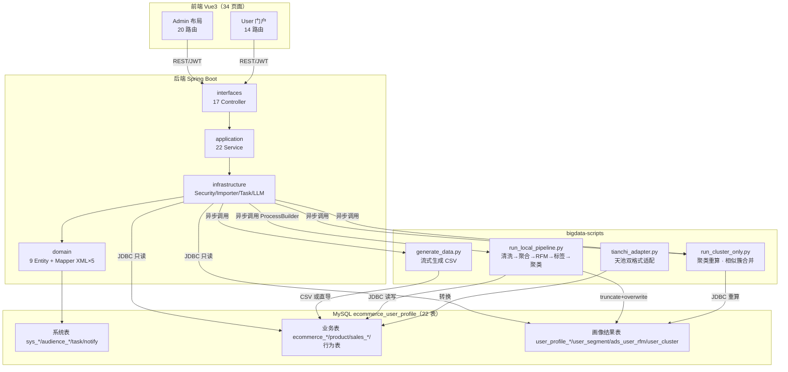

# 电商用户画像分析系统 — 项目全景分析报告

> 基于对代码库（backend / frontend / bigdata-scripts / docs）的逐层深入审查整理。
> 更新日期：2026-08-18

---

## 1. 项目全貌概述

### 1.1 背景与目标

针对电商行业**海量用户行为数据分散、分析效率低、运营不够精准**的痛点，本项目构建了一套完整的用户画像分析平台：

- **数据侧**：Python 脚本批量生成合规电商模拟数据（用户 / 商品 / 订单 / 浏览 / 登录），数据规模百级~十万级可调，无隐私风险；
- **计算侧**：PySpark 完成数据清洗（DWD）→ 用户聚合（DWS）→ RFM 分层 + 标签 + K-Means 聚类 → 画像结果写回 MySQL；
- **应用侧**：Spring Boot 后端以只读方式查询画像结果表，Vue 3 前端通过 ECharts 可视化呈现，支撑精准营销、活动策划与精细化运营。

### 1.2 运行模式（已剔除集群模式）

> 2026-08-18 已物理删除集群模式（`bigdata-scripts/hive/`、`rfm_profile_job.py`、`sync_ads_to_mysql.py`），当前仅两种模式。

| 模式 | 说明 | 数据源 |
| --- | --- | --- |
| **本地 PySpark 模式**（默认） | 单脚本全链路，直读 MySQL 业务表计算 | `run_local_pipeline.py`（画像全量）/ `run_cluster_only.py`（聚类重算），JDBC 直连 |
| **演示模式** | 无 Spark 环境时用 MySQL 聚合 SQL 生成画像结果 | `DemoDataImporter`（demo-import Profile） |

### 1.3 技术栈总览

**后端**：Java 17 / Spring Boot 3.3.7 / MyBatis-Plus 3.5.16 / MapStruct 1.6.3 / JJWT 0.12.7 / Knife4j 4.5.0 / Spring Security / Spring Retry / HttpClient5 / H2(测试)

**前端**：Vue 3.5 + TypeScript 5.6 / Vite 7.1 / Element Plus 2.11 / Tailwind CSS 4.1 / Pinia 3 (+persistedstate) / Vue Router 4.5 / ECharts 6 / Axios / vue-i18n / xlsx / @wangeditor / xgplayer

**大数据**：Python 3（数据生成，纯标准库）、PySpark（画像计算）、JDK 17（Spark 运行必需）

### 1.4 仓库目录结构

```
ecommerce-user-profile/
├── backend/              # Spring Boot 后端（DDD 风格分层）
├── frontend/             # Vue 3 管理端 + 用户门户
├── bigdata-scripts/      # 数据生成 / PySpark 画像 / 天池适配 / 脏数据治理
├── docs/                 # 14 份技术文档 + SQL Schema + 架构图（2026-08-18 已清理 9 份历史遗留）
├── design-system/        # 设计令牌（Design Tokens）文档
├── AGENTS.md             # 项目约定与命令
└── 简历/、数据导入总表_10个新用户.csv   # 演示/导入素材
```

---

## 2. 模块划分与职责

### 2.1 后端分层（包名 `com.oufeng.ecommerceuserprofile`）

```
interfaces      Controller 层（17 个）—— 参数接收、响应封装、@PreAuthorize 权限
   │
application     Service 层（22 个）—— 业务逻辑、事务、任务编排
   │
domain          Entity(9) / Mapper / DTO(按域分包) / MapStruct Converter
   │
infrastructure  基础设施：Security(JWT) / importer(10类) / task / llm / mapper XML / config / util
   │
common          Result<T> / ResultCode / UserRole / BusinessException / BaseEntity
```

**分层规则（AGENTS.md 约定）**：Controller 只做参数接收与响应；业务逻辑在 Service；Entity↔DTO 用 MapStruct；分页用 `Page<T>` + LambdaQueryWrapper；复杂查询用 Mapper XML。

### 2.2 Controller 接口族（17 个，全部 `/api/v1` 前缀）

| 接口族 | 路由 | 功能要点 |
| --- | --- | --- |
| AuthController | `/auth` | 注册/登录/JWT/me/改密/登录日志 |
| UserProfileController | `/profiles` | 概览、分层分布、标签分布、交叉矩阵、指标、省份排行、画像分页列表、CSV 导出 |
| ProductAnalysisController | `/admin/product-analysis` | 商品总览、Top10、品类占比、价格带、头部贡献度 |
| RepeatAnalysisController | `/admin/repeat-analysis` | 购买频次分布、复购率、购买间隔、月度留存 cohort、高复购 Top10 |
| ChurnAnalysisController | `/admin/churn-analysis` | 流失等级、名单分页、版本、CSV 导出 |
| ClusterAnalysisController | `/admin/cluster-analysis` | 簇概览、簇内用户、重算聚类（仅 Admin） |
| AdminAudienceController | `/admin/audience` | 圈选估算、搜索、导出、人群包 CRUD、对比分析 |
| AdminAnalysisTaskController | `/admin/analysis-tasks` | Spark 任务 CRUD、取消 |
| AdminDataImportController | `/admin/import` | 模板下载、预览、path/upload、天池导入 |
| AdminDataGenerateController | `/admin/data-generate` | 预设方案、数据生成、清空 |
| AdminSystemUserController | `/admin` | 系统用户 CRUD、启停、重置密码、登录日志 |
| AdminTagDefinitionController | `/admin/tags` | 标签定义 CRUD、规则预览、重算 |
| AIChatStreamController | `/ai` | SSE 流式 / 普通 chat（DeepSeek 或 Mock） |
| AiChatHistoryController | `/ai/history` | AI 会话历史 |
| SysNotificationController | `/notifications` | 系统通知（未读/标读） |
| PublicController | `/public` | 公开数据 |
| SystemController | `/system` | 健康检查 |

### 2.3 前端组织（src/）

```
src/
├── api/            # 8 个 API 模块：auth / profile / admin / product / cluster / churn / repeat / notification
├── router/         # staticRoutes(6) + adminRoutes(20) + userRoutes(14)，hash 模式
├── store/          # 唯一 Pinia store：user（isLogin/info/accessToken，localStorage 持久化）
├── views/          # 34 个页面组件（admin 17 + user 8 + 认证 3 + 异常 3 + landing 等）
├── components/     # ui/（AuthLayout、SvgIcon）+ core/（NotifBell 通知铃铛、AIChatWidget AI 浮窗）
├── directives/     # v-auth / v-roles / v-highlight / v-ripple
├── plugins/        # echarts.ts 按需注册（7 图表 + 11 组件，Canvas 渲染）
├── utils/          # http 封装 / sse 流式解析 / storage / sys
├── types/          # 按域分目录的 TS 类型（api / common / router / store ...）
└── assets/         # styles（tailwind.css 核心 + custom）
```

**双角色页面体系**：
- **Admin 布局**（`views/admin/index.vue`，玻璃拟态侧边栏）：仪表盘、画像、标签、任务、数据生成、数据导入、系统管理、人群运营、4 个分析页
- **User 门户**（`views/user/index.vue`，SaaS 左导航）：工作台、画像、标签、AI 分析，以及**复用管理端组件**的 4 个分析页 + 人群圈选（`/user/xxx` 路由指向同一组件）

**路由守卫**（`router/guards/beforeEach.ts`）：全部静态注册、无动态路由；①公开路径放行（已登录访问 `/` 按角色跳转）②未登录跳首页带 redirect ③`meta.roles` 与用户 role 不匹配跳 403。

### 2.4 数据库（MySQL 8.0，22 张表）

| 领域 | 表 |
| --- | --- |
| 系统管理 | `sys_user`、`sys_login_log`、`sys_notification` |
| 电商业务 | `ecommerce_user`、`product_category`、`product` |
| 用户行为 | `user_browse_behavior`、`user_login_behavior` |
| 交易业务 | `sales_order`、`sales_order_item` |
| 画像分析 | `profile_tag_definition`、`user_profile_tag`、`user_profile_summary`、`user_segment`、`ads_user_rfm`、`user_cluster` |
| 人群运营 | `audience_package`、`audience_rule`、`audience_package_users`、`comparison_task`、`comparison_result` |
| 任务管理 | `spark_analysis_task` |
| AI 辅助 | `ai_chat_history` |
| 天池适配 | `transaction_data`、`interaction_data`、`product_data` |

**读写边界（关键设计）**：
- MyBatis-Plus 实体管理（9 张系统表）：`sys_user`、`profile_tag_definition`、`audience_*`、`spark_analysis_task`、`sys_notification`、`sys_login_log`、`ai_chat_history`
- **业务/分析表（13+ 张）无实体**，由 importer / PySpark JDBC / Mapper XML 原生 SQL 操作——这是"结果表只读、Spark 负责写入"的边界体现

**规范**：BIGINT 主键 / DECIMAL(18,2) 金额 / DATETIME(3) 业务时间 / utf8mb4 / InnoDB / 角色库值固定 `User`、`Admin`。

---

## 3. 模块关系图谱



---

## 4. 关键流程讲解

### 4.1 数据生产与画像计算链路（核心主线）

```
generate_data.py ──► MySQL 业务表（可经 CSV 导入器）──► run_local_pipeline.py ──► 画像结果表 ──► 查询 API ──► 前端可视化
   （模拟数据）              （7 张源表）                （PySpark 计算）          （5 张结果表）    （只读）
```

**PySpark 管线三个阶段**（`run_local_pipeline.py`，本地 `local[*]`）：

1. **DWD 清洗**：
   - 用户：`status=1`、年龄 1~120、按 id 去重
   - 商品：`unit_price>=0`，left join 分类
   - 订单：仅 Paid/Shipped/Completed 为有效订单，校验 `payment_amount = total - discount`、`paid_at >= ordered_at`、下单时间 ≥ 注册时间
   - 行为：限 4 种类型并关联商品取分类、行为时间 ≥ 注册时间
2. **DWS 聚合**：
   - 订单指标：订单数 / 实付总额 / 客单价 / 最近下单日 / `recency_days`（统计日 - 最大下单日）
   - 近 30 日行为与登录统计
   - **偏好分类加权**：View=1 / Click=2 / Favorite=4 / Cart=5 按用户×分类求和取 top1；行为优先，无行为用户按消费金额 top1 品类兜底（full join + coalesce）
3. **画像产出**：
   - **RFM**：R=recency_days、F=订单数、M=实付总额；`NTILE(5)` 全局分桶，R 反向 `6-ntile`（无订单强制 1）；综合得分 `R×0.4 + F×0.3 + M×0.3`
   - **8 分类**（以 3 为阈值）：重要价值/重要发展/重要保持/重要挽留、一般价值/一般发展/一般保持、流失
   - **5 层分群**：`HIGH_VALUE`→高价值；`HIGH_DEVELOP+HIGH_RETAIN`→潜力；`LOST_RETAIN+GEN_DEVELOP+GEN_RETAIN`→流失风险；`GEN_VALUE`→一般；其余→低价值
   - **4 类标签**（tag_id 1~4）：活跃等级（30 日登录+浏览 ≥50 High / ≥15 Medium）、消费能力（实付 ≥1 万 High / ≥3 千 Medium）、偏好分类 ID、RFM 分层
   - **K-Means 聚类**：4 维特征（消费/订单/30 日浏览/30 日登录）标准化，默认 k=5
4. **写 MySQL**：JDBC `truncate + overwrite` 写 5 张结果表，密码取环境变量 `MYSQL_PASSWORD`

### 4.2 数据导入流程（importer 包）

```
上传/指定目录 CSV
   │
   ▼
AbstractCsvImporter（10 个子类，按表分派）
   │  ├─ CsvParser：处理引号/换行
   │  ├─ 中文列名↔英文映射（CsvColumnNames）
   │  ├─ 唯一键去重（user_code/order_no/product_code/category_name）→ 更新
   │  ├─ ImportIdAllocator：id 冲突自动分配
   │  ├─ ImportIdMapper：跨表外键重映射
   │  └─ 行级容错 + 错误样本收集
   ▼
ON DUPLICATE KEY UPDATE 批量写
   │
   ▼
ImportReport 统计（成功/失败/耗时）→ 通知 + 审计
```

- **ImportTableGuesser**：按文件名关键词猜表，依赖排序 基表→关联表
- **CompositeCsvImporter**：总表一个 CSV 含全部表（首列「表名」），共享 idMapper
- **天池流程**：上传 CSV → `tianchi_adapter.py` 转换（120s 超时）→ 产物校验 → 异步导入
- 天池**行为集**（pv/buy/cart/fav → View/Purchase/Cart/Favorite）与**发票集**（gender/age/category 保留，订单状态 Completed，`paid_at=ordered_at`）双格式自动检测

### 4.3 认证与权限流程

```
登录 POST /auth/login
   │  密码 BCrypt 校验 + RateLimit（每 IP 60s 10 次）
   ▼
JwtTokenProvider 签发 HS256 Token
   │  claims: uid / displayName / role，默认 28800s 过期
   ▼
前端 axios 请求拦截器注入 Authorization: Bearer
   ▼
JwtAuthenticationFilter（OncePerRequestFilter）
   │  解析 token → 构造 ROLE_USER/ROLE_ADMIN 权限 → SecurityContext
   ▼
SecurityConfig：/auth/login、/register、/public/**、/system/health 公开；
               业务分析接口 hasAnyRole("ADMIN","USER")；/admin/** 仅 ADMIN；
               @EnableMethodSecurity + @PreAuthorize 细控（聚类重算、公告广播）
   ▼
401/403 统一 JSON 返回 → 前端响应拦截器 401 触发防抖登出（3s）
```

### 4.4 分析任务执行与通知流程

```
前端创建任务（画像计算 / 聚类重算 / 数据生成 / 数据导入）
   │
   ▼
AnalysisTaskServiceImpl 状态机：Pending → Running → Succeeded / Failed
   │  @PostConstruct 恢复中断任务（重启后 Pending 任务置回）
   ▼
固定线程池 executor 异步执行：
   │  ├─ run_local_pipeline.py（PROFILE_FULL，30min 超时）
   │  ├─ run_cluster_only.py（CLUSTER_RECALC，K=2-20，--no-merge）
   │  ├─ generate_data.py（DATA_GENERATE）
   │  └─ 目录/上传导入（DATA_IMPORT）
   │  注意：MultipartFile 在 HTTP 线程持久化到磁盘，避免异步线程中失效
   ▼
成功 → broadcast 通知全员（sys_notification + 前端 10s 轮询弹窗）
   │  画像任务后追加：高价值用户流失预警 SQL 检测
   ▼
失败 → TaskErrorTranslator 将原始报错翻译为人话，存任务记录
```

### 4.5 AI 智能分析流程（DeepSeek + 安全 SQL 执行）

```
前端 AI 页面 / AIChatWidget 浮窗
   │
   ▼
AIChatStreamController（SSE 流式 /chat 非流式）
   │  ① JDK HttpClient 逐块转发 DeepSeek（OpenAI 兼容协议）
   │  ② 无 API Key → MockLLMProvider 降级（关键词规则 + 直接查库）
   ▼
SchemaContext 注入表结构 + SQL 硬性规则 + few-shot 提示
   │
   ▼
从回答中提取 ```sql 块 → validateSql 安全校验：
   │  多语句 / 子查询 / 注释 / 危险函数黑名单 + 11 张表查询白名单
   ▼
执行 SQL → 失败则回喂模型重试一次 → 结果存 ai_chat_history（dataJson 供前端渲染图表）
```

### 4.6 前端请求链路

```
页面组件 ──► api/xxx.ts ──► utils/http（axios 实例，timeout 45s）
   │                             ├─ 请求拦截器：注入 Bearer Token
   │                             └─ 响应拦截器：code 校验 / blob 放行 / 401 防抖登出
   ▼
ECharts 渲染（plugins/echarts.ts 按需注册）
   ├─ dashboard/console：活跃用户折线 + 任务柱状 + 分层环形饼
   ├─ product-analysis：Top10 柱状 + 品类饼图 + 价格带双轴柱
   ├─ repeat-analysis：留存 Cohort 热力图 + 复购率环形
   ├─ cluster-analysis：用户特征雷达图
   └─ audience/comparison：双人群分组/堆叠柱状 + 环形对比
```

---

## 5. 主要依赖与运行环境

### 5.1 环境变量（敏感信息全走环境变量，不落源码）

| 变量 | 用途 | 默认值 |
| --- | --- | --- |
| `DB_URL` / `DB_USERNAME` / `DB_PASSWORD` | MySQL 连接（密码无默认值，必须提供） | localhost:3306/ecommerce_user_profile |
| `JWT_SECRET` | JWT 签名密钥（≥32 字节，启动强校验） | 无 |
| `JWT_EXPIRATION_SECONDS` | Token 有效期 | 28800 |
| `AI_API_KEY` | DeepSeek API Key（缺省降级 Mock） | 无 |
| `SERVER_PORT` | 服务端口 | 8080 |
| `SPARK_SCRIPT_PATH` / `SPARK_IMPORT_DIR` | PySpark 脚本与数据目录 | ../bigdata-scripts/... |
| `JAVA_HOME_17` | Spark 运行所需 JDK 17 路径 | 当前 JVM |
| `MYSQL_PASSWORD` | PySpark JDBC 写库密码 | 无 |

### 5.2 构建与运行命令

```bash
# 后端（backend/）
./mvnw clean package     # 构建
./mvnw test              # 测试（H2 内存库）
./mvnw spring-boot:run   # 启动

# 前端（frontend/）
pnpm install
pnpm dev                 # 开发（Vite，端口由 vite.config 决定）
pnpm build               # 生产构建

# 数据生成 / 画像计算（bigdata-scripts/）
python generate_data.py --users 100000 --products 10000 --behaviors 1000000 --orders 200000 --seed 2026
python spark/run_local_pipeline.py --data-version 20260711
python -m unittest test_generate_data.py   # 生成器自测
```

### 5.3 测试体系（19 个测试类，约 1500 行，H2 内存库）

- **application 服务层**（7）：Auth / UserProfile / AudienceSegmentation / TagDefinition / Notification / AnalysisTask / AiChatHistory
- **infrastructure/importer**（7）：CompositeCsvImporter、ImportIdAllocator、OrchestratorComposite、MergedTemplate、Tianchi×3
- **infrastructure/util**（2）：BigdataPathResolver、TaskErrorTranslator
- **interfaces**（2+1）：AuthController、UserProfileController MockMvc 集成 + 上下文冒烟

**测试缺口**：4 个分析 Service（Product/Repeat/Churn/Cluster）与人群圈选的对比分析无单测。

---

## 6. 已知问题与维护注意事项

### 6.1 已知问题清单

| # | 问题 | 状态 |
| --- | --- | --- |
| 1 | 标签定义管理：后端 CRUD 完整，**前端缺管理页面**（`/system/tag-definition` 路由已注册但页面待完善） | 待办 |
| 2 | 导入历史"批量重试"未实现（参数未存库，按钮已置灰） | 待办 |
| 3 | 大数据链路依赖本地 Python + Spark，**JDK 必须 17**（跑管线需 `JAVA_HOME=/d/JAVA/JDK-17`） | 环境约束 |
| 4 | 缺少 Docker 容器化方案（`deployment.md` 有文档但无 docker-compose） | 待办 |
| 5 | 4 个分析 Service 与对比分析缺测试 | 待办 |
| 6 | AGENTS.md 早期版本 Spring Boot 版本曾误标 4.1.0（现已修正为 3.3.7） | 已修复 |
| 7 | spark-profile.md RFM 权重曾与代码不一致（30/30/40 vs 40/30/30），现文档已统一为 **0.4/0.3/0.3** | 已修复 |
| 8 | ~~docs/architecture.md 描述旧架构（JPA、16 表、单角色）与代码脱节~~ **已删除**（2026-08-18 清理历史文档，架构内容由本文档承接） | 已清理 |
| 9 | ~~集群模式残留文件 `rfm_sql_8seg.py`~~ **已物理删除**（2026-08-18，连同 docs 集群字样一并清理） | 已清理 |

### 6.2 维护注意事项（踩坑经验）

1. **Tailwind v4 Windows 扫描 bug（高优先级）**：`@tailwindcss/oxide` 在 Windows 上 `**` glob 无法递归扫描子目录。当前 `tailwind.css` 用约 24 条显式 `@source ".../*.vue"` 声明覆盖。**新增含 Tailwind class 的 .vue 目录时，必须同步添加 @source 声明**，否则样式静默失效（CSS 从 84KB 掉回 14KB）。Tailwind 修复后可回归单行 `@source "**/*.{vue,ts}"`。
2. **画像结果表是"重算即覆盖"**：`truncate + overwrite` 意味着任何接口查询都依赖最近一次成功管线结果；画像任务失败时前端应提示"数据可能过期"。
3. **双角色字段不匹配**：后端返回单数 `role`，前端部分组件期望数组 `roles`，改角色相关代码时注意适配层转换。
4. **缓存已全部移除**：标签/概览/分层实时查库，无 @Cacheable；新增查询注意 MySQL 索引，海量行为表（browse_behavior 百万级）避免全表扫描。
5. **导入唯一键语义**：user_code / order_no / product_code / category_name 作为自然键，导入同键数据走"更新"而非"插入"，重放导入是幂等的。
6. **任务超时与恢复**：pipeline 30min 超时；应用重启后 Pending 任务会被 @PostConstruct 恢复——修改任务状态机时务必保留该逻辑。
7. **SQL 安全白名单**：AI SQL 执行与标签规则计算都用了白名单/黑名单校验，新增表/标签时需同步维护（AI 11 表白名单、标签规则黑名单关键字）。
8. **Schema 变更流程**：`docs/sql/mysql-schema.sql` 是全量基线，增量用 `mysql-schema-migration.sql`；业务表无实体类，改列名需同步改 Mapper XML 与 PySpark 脚本，三处联动。

### 6.3 后续开发建议（按优先级）

1. **补齐标签定义管理前端页面**（后端已就绪，闭环最快）；
2. **给 4 个分析 Service + 对比分析补测试**，用 H2 + 样例数据，防止 SQL 回归；
3. **核对 docs/database-model.md 与 data-dictionary.md** 是否与最新表结构（22 表）一致，必要时补充新增表；
4. **Docker 容器化**：backend + MySQL + 前端 nginx，Spark 管线可放宿主机（容器内跑 PySpark 依赖较重）；
5. **画像任务失败可观测性**：在任务详情页展示 TaskErrorTranslator 的人话错误 + 原始日志尾部；
6. **数据版本管理**：user_profile_summary 已有版本字段（Spark 重算时更新），可考虑支持"按版本回看历史画像"；
7. **性能优化方向**：概览/分层分布聚合可改为每日快照表（当前实时查百万级行为表），或用 Redis 缓存带失效时间。

---

## 7. 结语

本项目是一个**"数据生产 → 分布式计算 → 画像沉淀 → 可视化运营"**的完整闭环示例，技术选型务实（Spring Boot + Vue 3 + PySpark 都是主流栈），架构分层清晰、读写边界明确、安全设计到位（JWT + 角色权限 + SQL 白名单 + 限流）。后续扩展时，把握三条主线即可快速定位：**画像结果表是只读查询边界**、**任务调度是异步编排中枢**、**importer + pipeline 是数据入口**。
