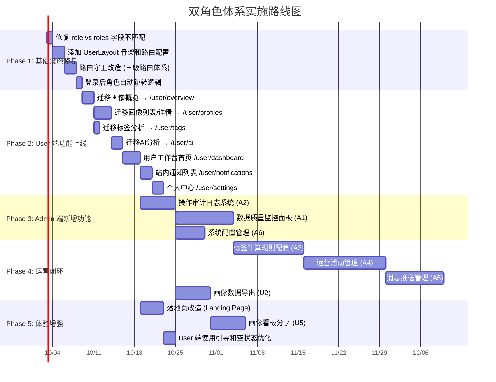

# 电商用户画像分析系统 — 需求文档说明书

> **文档版本**：v1.0  
> **编制日期**：2026-07-18  
> **文档定位**：整合三轮分析成果的完整需求说明书，作为后续开发实施的统一参照  
> **关联文档**：functional-analysis.md, business-planning-analysis.md, project-codebase-analysis.md

---

## 目錄

1. [项目概述](#1-项目概述)
2. [项目现状与已有功能盘点](#2-项目现状与已有功能盘点)
3. [角色定义与用户定位](#3-角色定义与用户定位)
4. [前端页面架构与路由设计](#4-前端页面架构与路由设计)
5. [双角色功能扩展规划](#5-双角色功能扩展规划)
6. [落地页设计](#6-落地页设计)
7. [权限边界与数据流转](#7-权限边界与数据流转)
8. [已知差距与待修复问题](#8-已知差距与待修复问题)
9. [实施路线图](#9-实施路线图)
10. [工作量估算](#10-工作量估算)
11. [附录](#11-附录)

---

## 1. 项目概述

### 1.1 项目定位

电商用户画像分析系统，基于 Spring Boot + Vue 3 + PySpark 技术栈构建。系统解决电商行业海量用户行为数据分散、分析效率低、用户价值难以量化、运营不够精准的痛点，为电商精准营销和精细化运营提供数据支撑。

### 1.2 技术栈

| 层次 | 技术 | 版本 |
|------|------|------|
| 后端框架 | Spring Boot | 3.3.7 |
| Java 版本 | JDK | 17 |
| 持久层 | MyBatis-Plus | 3.5+ |
| 对象映射 | MapStruct | 1.6.3 |
| 安全认证 | Spring Security + JWT (jjwt 0.12.7) | — |
| 前端框架 | Vue 3 + TypeScript | 3.5.21 |
| 前端 UI | Element Plus + Tailwind CSS | 2.11.2 / 4.1.14 |
| 图表 | ECharts | 6.0 |
| 状态管理 | Pinia | 3.0 |
| 大数据 | PySpark | — |
| 画像计算 | PySpark 本地管线（清洗→聚合→RFM/标签/聚类） | — |
| 数据库 | MySQL | 8.0+（utf8mb4，22 张表） |
| 构建 | Maven（后端）/ pnpm（前端） | — |

### 1.3 运行模式

| 模式 | 适用场景 | 数据路径 | 硬件要求 |
|------|---------|---------|---------|
| **本地 PySpark 模式** | 开发/演示环境 | 数据生成 → PySpark 画像计算 → MySQL | 单机（Windows 本地） |
| **本地 PySpark 模式** | 小团队内部使用（< 10 万用户） | CSV → PySpark（本地）→ MySQL | 16G 内存单机 |
| **演示模式** | 个人开发、客户演示 | DemoDataImporter（Java）→ MySQL | 任意笔记本 |

---

## 2. 项目现状与已有功能盘点

### 2.1 现有 12 个模块

系统按业务域划分为 **8 个核心模块 + 4 个辅助模块**：

| # | 模块 | 定位 | 角色 | 说明 |
|---|------|------|------|------|
| 1 | 认证授权模块 | 【辅助】安全基座 | User/Admin | JWT 无状态认证，Spring Security 路径级鉴权 |
| 2 | 用户画像查询模块 | 【核心】画像消费 | User/Admin | 概览/分层分布/标签分布/列表/详情，三级缓存 |
| 3 | 画像计算引擎模块 | 【核心】画像生产 | Admin 触发 | PySpark RFM NTILE(5) + 5/8 分类 + 4 类标签 |
| 4 | 数据生成与导入模块 | 【核心】数据供给 | Admin | Python 流式 CSV 生成，编排器导入 MySQL |
| 5 | 人群圈选与对比模块 | 【核心】运营应用 | Admin | 12 字段动态 SQL 圈选 + 预估 + A/B 5 维对比 |
| 6 | 标签管理模块 | 【辅助】标签字典 | Admin | 标签编码/名称/类型/状态 CRUD |
| 7 | 分析任务管理模块 | 【辅助】作业调度 | Admin | 3 类任务（PROFILE/DATA_IMPORT/DATA_GENERATE）|
| 8 | 系统管理模块 | 【辅助】后台管理 | Admin | 系统用户 CRUD + 登录审计 |
| 9 | AI 智能分析模块 | 【辅助】自然语言查询 | User/Admin | DeepSeek SSE 流式 + SQL 白名单安全 |
| 10 | 站内通知模块 | 【辅助】消息触达 | User/Admin | 通知列表/已读标记/事件触发 |
| 11 | 画像计算模块 | 【核心】离线加工 | 本地 PySpark | 清洗 → 聚合 → 分层 → 标签 |

### 2.2 现有后端 API（39 个端点）

| 模块 | 端点数 | 公开 | User 角色 | Admin 角色 |
|------|--------|------|-----------|-----------|
| 认证管理 | 4 | 2（登录/注册） | 4 | 4 |
| 系统管理 | 1 | 1（健康检查） | 1 | 1 |
| 用户画像 | 5 | 0 | 5 | 5 |
| 公开数据 | 4 | 4 | 4 | 4 |
| Admin: 用户管理 | 6 | 0 | 0 | 6 |
| Admin: 标签定义 | 5 | 0 | 0 | 5 |
| Admin: 分析任务 | 5 | 0 | 0 | 5 |
| Admin: 数据导入 | 6 | 0 | 0 | 6 |
| 兼容接口 | 3 | 3 | 3 | 3 |
| **合计** | **39** | **10** | **17** | **39** |

### 2.3 现有前端页面

| 页面 | 路由 | 权限 | 开发状态 |
|------|------|------|---------|
| 落地页（官网） | `/` | 公开 | ✅ 已有骨架 |
| 登录页 | `/auth/login` | 公开 | ✅ 已实现 |
| 注册页 | `/auth/register` | 公开 | ⚠️ 未对接真实 API（setTimeout mock） |
| 忘记密码 | `/auth/forget-password` | 公开 | ❌ 空壳（提交函数为空） |
| 画像概览仪表盘 | `/dashboard/overview` | User + Admin | ✅ 已实现 |
| 用户画像列表 | `/profiles` | User + Admin | ✅ 已实现 |
| 用户画像详情 | `/profiles/:id` | User + Admin | ✅ 已实现 |
| 标签分布分析 | `/tags` | User + Admin | ✅ 已实现（部分组件待完善） |
| AI 智能分析 | 内嵌组件 | User + Admin | ✅ 已实现 |
| 分析任务管理 | `/tasks` | Admin | ✅ 已实现 |
| 系统用户管理 | `/system/users` | Admin | ✅ 已实现 |
| 数据导入 | `/admin/import` | Admin | ✅ 已实现 |
| 数据生成 | `/admin/data-generate` | Admin | ✅ 已实现 |
| 人群圈选 | `/admin/audience` | Admin | ✅ 已实现 |
| 画像对比 | `/admin/audience/comparison` | Admin | ✅ 已实现 |
| 人群包管理 | `/admin/audience/packages` | Admin | ✅ 已实现 |

### 2.4 开发完成度评估

| 模块 | 完成度 | 说明 |
|------|--------|------|
| 后端核心框架 | 90% | 分层清晰，安全/ORM/文档齐全 |
| 后端 API | 85% | 39 个端点已实现；部分高级功能待完善 |
| 前端框架 | 85% | 布局/路由/权限/主题完善 |
| 前端业务页面 | 70% | 核心页面已开发，部分页面待完善 |
| 大数据管线 | 90% | 数据生成/数仓/Spark 计算/同步链路完整 |
| 测试覆盖 | 30% | 大数据脚本有测试；后端/前端业务测试缺失 |
| 文档 | 80% | 覆盖主要方面；部分细节待修正 |
| 部署方案 | 60% | 有部署文档但缺少 Docker/CI-CD |
| **综合** | **≈75%** | 核心链路已打通，处于可用但待完善阶段 |

---

## 3. 角色定义与用户定位

### 3.1 角色体系决策

采用 **双角色体系**（User + Admin），现阶段不扩展 5 级角色。

| 角色 | 编码 | 定位 | 典型用户 | 核心工作 |
|------|------|------|---------|---------|
| **运营分析员** | `User` | 画像数据消费者 | 电商运营专员、品类运营、数据分析师 | 查看画像、AI 分析、生成报表 |
| **系统管理员** | `Admin` | 系统管理者 + 数据生产者 | 技术运维、系统管理员 | 数据生产、任务调度、系统配置、质量监控 |

### 3.2 用户画像

| 维度 | 普通用户（User） | 管理员（Admin） |
|------|----------------|----------------|
| 角色定位 | 画像数据消费者 | 系统拥有者 + 数据生产者 |
| 核心工作 | 查看分析、AI 查询、画像浏览 | 数据生成/导入、任务调度、系统配置、人群圈选 |
| 关注内容 | 画像结果、趋势变化、分层分布 | 管线运行状态、数据质量、系统用户、任务管理 |
| 操作范围 | 只读为主 + AI 交互 | 全功能 CRUD + 系统管理 |
| 界面需求 | **简洁、聚焦、引导式** | **功能完整、批量操作、监控面板** |
| 典型路径 | 登录 → 看概览 → 看详情 → 查询 → 退出 | 登录 → 检查任务 → 管理数据 → 配置系统 |
| 使用频率 | 每日 1-3 次，每次 10-30 分钟 | 每日 2-4 次，每次 15-45 分钟 |
| 技术能力 | 懂业务但不懂技术 | 懂技术运维 |

### 3.3 角色设计决策

- ✅ **双角色系统够用**：内部工具场景下，User/Admin 双角色满足当前使用需求
- ❌ **暂不扩展 5 级角色**：不增加 SUPER_ADMIN / OP_MANAGER / DATA_ANALYST / READ_ONLY 等细粒度角色
- 🔮 **未来扩展**：当用户量达到 50+ 人或引入外部合作伙伴时，再升级到多角色体系

---

## 4. 前端页面架构与路由设计

### 4.1 当前问题诊断

**问题根因**：后端返回的 `role` 字段（单数 string）与前端读取的 `roles` 字段（复数 array）不匹配，导致前端菜单角色过滤完全失效。

| 位置 | 字段名 | 类型 | 值示例 |
|------|--------|------|--------|
| 后端 API `/api/v1/auth/me` 返回 | `role` | `string` | `"User"` |
| 前端类型定义 `Api.Auth.UserInfo` | `role` | `string` | `"User"` |
| 前端 `MenuProcessor` 读取 | `roles` | `string[]` | `undefined` |

**修复方案**：在 `MenuProcessor.processFrontendMenu()` 中增加兼容处理：

```typescript
const userRole = userStore.info?.role
const roles = userStore.info?.roles ?? (userRole ? [userRole] : [])
```

### 4.2 推荐架构方案

**方案 B：同一 SPA，不同布局**（⭐⭐⭐⭐⭐ 推荐）

```
前端 SPA
├── PublicLayout  → 落地页 / 认证页
├── UserLayout    → 用户工作台（简洁导航，仅 6-8 项）
└── AdminLayout   → 管理后台（现有侧边栏 + 完整菜单）
```

### 4.3 三级路由体系

#### 1️⃣ 公开路由（匿名可访问，PublicLayout）

| 路由 | 页面 | 说明 |
|------|------|------|
| `/` | 落地页（Landing Page） | 官网首页，品牌展示 |
| `/auth/login` | 登录页 | 账号密码登录 |
| `/auth/register` | 注册页 | 新用户注册 |
| `/auth/forget-password` | 忘记密码 | 密码重置 |
| `/403` | 403 异常页 | 权限不足提示 |
| `/:pathMatch(.*)*` | 404 异常页 | 路由未匹配 |
| `/500` | 500 异常页 | 服务器错误 |

#### 2️⃣ 普通用户路由（需登录 + User 角色，UserLayout）

| 路由 | 页面 | 类型 | 说明 |
|------|------|:----:|------|
| `/user/dashboard` | **用户工作台** | **新增** | 聚合 KPI + 最近查看 + 快捷入口 |
| `/user/overview` | 画像概览仪表盘 | 迁移 | 4 KPI + 分层分布 + 覆盖率 |
| `/user/profiles` | 画像列表 | 迁移 | 分页 + 搜索 + 分层筛选 |
| `/user/profiles/:id` | 画像详情 | 迁移 | 用户维度指标 + 标签信息 |
| `/user/tags` | 标签分析 | 迁移 | 4 类标签分布柱状图 |
| `/user/ai` | AI 智能分析 | 迁移 | 独立页面，自然语言查询 |
| `/user/notifications` | 站内通知 | **新增** | 通知列表 + 已读管理 |
| `/user/settings` | 个人中心 | **新增** | 修改密码 + 通知偏好 |

#### 3️⃣ 管理员路由（需登录 + Admin 角色，AdminLayout）

| 路由 | 页面 | 类型 |
|------|------|:----:|
| `/dashboard/overview` | 画像概览仪表盘 | 现有 |
| `/profiles` / `/profiles/:id` | 画像列表/详情 | 现有 |
| `/tags` | 标签分析 | 现有 |
| `/tasks` | 分析任务管理 | 现有 |
| `/admin/import` | 数据导入 | 现有 |
| `/admin/data-generate` | 数据生成 | 现有 |
| `/admin/audience` | 人群圈选 | 现有 |
| `/admin/audience/comparison` | 画像对比 | 现有 |
| `/admin/audience/packages` | 人群包管理 | 现有 |
| `/system/users` | 系统用户管理 | 现有 |
| `/system/user-center` | 个人中心 | 现有 |
| `/admin/quality` | 数据质量监控 | **Admin 新增** |
| `/admin/audit-logs` | 操作审计日志 | **Admin 新增** |
| `/admin/settings` | 系统配置管理 | **Admin 新增** |
| `/admin/tag-rules` | 标签规则配置 | **Admin 新增** |
| `/admin/campaigns` | 运营活动管理 | **Admin 新增** |
| `/admin/push-tasks` | 消息推送管理 | **Admin 新增** |

### 4.4 路由守卫逻辑

```
用户导航到URL → 在公开路由中？→ 是 → 放行
                               → 否 → 已登录？→ 否 → 跳转落地页 + login=true + redirect
                                               → 是 → 角色匹配？→ 匹配 → 对应 Layout 放行
                                                                 → 不匹配 → 跳转 /403
```

### 4.5 登录后角色自动跳转

| 场景 | 行为 |
|------|------|
| User 登录成功 | 跳转 `/user/dashboard`（用户工作台） |
| Admin 登录成功 | 跳转 `/dashboard/overview`（管理后台仪表盘） |
| 已登录 User 访问 `/` | 自动跳转 `/user/dashboard` |
| 已登录 Admin 访问 `/` | 自动跳转 `/dashboard/overview` |
| 未登录访问受保护路由 | 路由守卫拦截，跳转 `/?login=true&redirect=原路径` |

### 4.6 目录结构建议

```
frontend/src/
├── layouts/
│   ├── public-layout.vue         # 公开页面布局（现有）
│   ├── user-layout.vue           # ★ 新增：用户页面布局
│   └── admin-layout.vue          # 现有后台管理布局
├── views/
│   ├── landing/                  # 落地页（现有）
│   ├── auth/                     # 认证页（现有）
│   ├── user/                     # ★ 新增：用户页面
│   │   ├── dashboard.vue         # 用户工作台首页
│   │   ├── overview.vue          # 画像概览
│   │   ├── profiles/             # 画像列表/详情
│   │   ├── tags.vue              # 标签分析
│   │   ├── ai.vue                # AI 智能分析
│   │   ├── notifications.vue     # 站内通知
│   │   └── settings.vue          # 个人中心
│   └── ...                       # 现有 Admin 页面不变
├── router/
│   ├── index.ts                  # ★ 改造：三级路由配置
│   ├── routes/
│   │   ├── publicRoutes.ts       # 公开路由
│   │   ├── userRoutes.ts         # ★ 新增：用户路由
│   │   └── adminRoutes.ts        # 现有管理员路由
```

---

## 5. 双角色功能扩展规划

### 5.1 Admin 端新增功能（6 项）

---

#### A1：数据质量监控面板 【P0 · 大 · 10-15 人天】

**功能定位**：Admin 的"数据健康中心"，全链路质量可视化。

**解决什么问题**：当前数据管线缺少可观测性，画像计算完成后无法判断数据是否可靠，脏数据影响 User 端分析结论。

**核心子功能**：
1. **数据源质量报告**：对各 MySQL 表进行空值率、唯一性、分布检查，生成质量评分（0-100）
2. **画像结果校验**：自动对比画像结果表与源表的记录数一致性，偏差 >5% 时告警
3. **管线运行状态**：展示数据生成/导入/Spark 任务的历史运行记录和成功率趋势图
4. **数据新鲜度指标**：表级最后更新时间展示，超过 24h 阈值标红告警
5. **质量规则配置**：可配置检查阈值、调度频率和告警方式

**技术模块**：后端 Spring @Scheduled + 前端 ECharts + 质量校验逻辑

**与 User 的衔接**：质量摘要（如"数据健康度 98%"）可在 User 工作台顶部展示

**新增数据表**：`data_quality_report`、`data_quality_rule`

---

#### A2：操作审计日志系统 【P0 · 中 · 5-8 人天】

**功能定位**：Admin 的"安全追溯中心"，记录全量关键操作。

**解决什么问题**：当前仅有登录审计日志，无法追溯谁在何时做了什么操作。数据异常或配置误改时无法定位责任人。

**核心子功能**：
1. **操作日志记录**：AOP 切面自动拦截关键操作（CRUD、导入、计算、圈选、配置变更），记录操作人/时间/IP/请求参数/执行结果
2. **日志查询筛选**：按时间范围、操作人、操作类型、模块组合筛选，支持分页
3. **操作详情查看**：单条日志展开查看完整请求参数和响应，敏感字段脱敏
4. **异常操作告警**：检测短时间内 N 次失败操作或批量删除等异常行为

**技术模块**：后端 Spring AOP + @AuditLog 注解 + 异步写入，前端筛选表格 + 详情抽屉

**与 User 的衔接**：User 的操作同样被记录，但 User 不可见审计日志

**新增数据表**：`ops_audit_log`

---

#### A3：标签计算规则配置 【P1 · 大 · 10-15 人天】

**功能定位**：Admin 的"标签规则管理中心"，将标签计算从硬编码转化为可配置。

**解决什么问题**：当前标签规则硬编码在 Spark 脚本中，运营调整标签阈值需找开发改代码+重新部署，周期长。

**核心子功能**：
1. **标签规则编辑器**：可视化配置规则（属性阈值、行为次数、金额区间等），AND/OR 条件组合
2. **规则变量管理**：从数据字典自动同步可用字段/指标/聚合函数
3. **规则测试运行**：在 1000 条样本上运行规则并展示结果分布
4. **规则生效调度**：支持立即生效 / 定时空闲时段 / 手动触发重算
5. **规则版本管理**：每次修改自动生成新版本，支持回溯和回滚

**技术模块**：后端规则解析器 + JSON 化存储，前端规则编辑器组件，Spark 规则引擎改造

**与 User 的衔接**：⚠️ **关键衔接** — Admin 配置/修改标签规则 → 触发 Spark 重算 → 更新标签结果 → User 端标签分析立即反映变化

**新增数据表**：`tag_calc_rule`、`tag_calc_rule_version`

---

#### A4：运营活动管理 【P1 · 大 · 12-18 人天】

**功能定位**：Admin/运营主管的"活动执行平台"，将人群圈选结果落地到实际运营。

**解决什么问题**：当前"圈选→分析→执行"链路断裂，运营人员圈选出人群后无法直接用于活动，效率低、易出错。

**核心子功能**：
1. **活动创建/编辑**：创建运营活动，关联目标人群包，设置时间/预算/类型（促销/优惠券/推送通知）
2. **活动状态管理**：待开始→进行中→已结束→已取消，自动按时间流转，支持手动提前结束
3. **活动效果统计**：展示覆盖人数、触达率、转化率、ROI 等指标，趋势曲线图
4. **活动历史归档**：已结束活动自动归档，只读可查

**技术模块**：后端 campaign 系列表 + 状态机流转，前端活动表单 + 效果看板

**与 User 的衔接**：活动关联的人群包来自圈选结果，活动效果数据可对 User 只读开放

**新增数据表**：`campaign`、`campaign_audience`、`campaign_metric`

---

#### A5：消息推送管理 【P1 · 中 · 8-12 人天】

**功能定位**：Admin/运营主管的"用户触达平台"，支持多渠道消息发送。

**解决什么问题**：运营活动需要触达用户，但当前仅有站内通知（AI 分析完成/任务完成），缺乏批量推送能力。

**核心子功能**：
1. **消息模板管理**：创建和管理模板，支持占位符变量，支持预览
2. **推送任务创建**：选择模板 + 目标人群包 + 推送渠道（站内信/邮件）
3. **推送任务状态**：待发送→发送中→已完成→部分失败，展示发送进度和失败明细
4. **推送历史查询**：按渠道/时间/活动筛选，查看统计摘要

**技术模块**：后端 message_template / push_task / push_record 表 + 策略模式渠道抽象

**与 User 的衔接**：⚠️ **直接衔接** — Admin 发起推送 → 站内信渠道 → User 通知列表接收

**新增数据表**：`message_template`、`push_task`、`push_record`

---

#### A6：系统配置管理 【P2 · 中 · 5-8 人天】

**功能定位**：Admin 的"系统控制台"，统一管理各类系统参数。

**解决什么问题**：Spark 管线路径、缓存 TTL、质量检查阈值等参数散落在代码和配置文件中，运维效率低。

**核心子功能**：
1. **配置分类管理**：Spark 管线 / 缓存 / 通知 / 质量检查 / 安全，至少 5 个分类
2. **配置项 CRUD**：支持新增/编辑/启用/禁用，支持字符串/数字/布尔/JSON 类型
3. **配置生效策略**：即时生效 / 需重启服务 两种模式
4. **配置变更历史**：记录每次修改的操作人和新旧值对比，支持一键回滚

**技术模块**：后端 sys_config key-value 表 + 内存缓存，前端配置管理页面

**新增数据表**：`sys_config`

---

#### Admin 新增功能总表

| 编号 | 功能 | 优先级 | 工作量 | 新增表 | 与 User 衔接 |
|:----:|------|:------:|:------:|:------:|-------------|
| A1 | 数据质量监控面板 | **P0** | 大 | 2 | 质量摘要展示在 User 工作台 |
| A2 | 操作审计日志系统 | **P0** | 中 | 1 | 无直接衔接，User 操作被审计 |
| A3 | 标签计算规则配置 | **P1** | 大 | 2 | ⚡ 直接影响 User 端标签分析 |
| A4 | 运营活动管理 | **P1** | 大 | 3 | 效果可对 User 只读开放 |
| A5 | 消息推送管理 | **P1** | 中 | 3 | ⚡ 站内信直接触达 User |
| A6 | 系统配置管理 | **P2** | 中 | 1 | 间接影响（缓存配置影响加载速度） |

---

### 5.2 User 端功能（5 项迁移 + 4 项新增 + 1 项可选）

#### 现有功能迁移清单

| 编号 | 功能 | 当前路由 | 目标路由 | 工作量 |
|:----:|------|---------|---------|:------:|
| M1 | 画像概览仪表盘 | `/dashboard/overview` | `/user/overview` | 小 |
| M2 | 画像列表/详情 | `/profiles` / `/profiles/:id` | `/user/profiles` | 中 |
| M3 | 标签分析 | `/tags` | `/user/tags` | 小 |
| M4 | AI 智能分析 | 内嵌组件 | `/user/ai` | 中 |

> **决策说明**：人群圈选功能保留在 Admin 端，User 端不开放（当前阶段）。User 如需圈选，可在侧边栏添加跳转入口。

---

#### 新增功能

##### U1：用户工作台首页 【P1 · 小 · 2-3 人天】

**定位**：User 登录后的"第一站"，聚合关键信息和快捷操作。

**子功能**：
1. 个性化欢迎语 + 系统状态提示（如"最新画像计算已完成"）
2. 4 个 KPI 摘要卡片（总用户数、画像覆盖率、高价值用户占比、日活跃用户）
3. 最近查看的画像列表（最多 5 条，支持快速跳转）
4. 快捷操作区：AI 智能查询 / 查看画像列表 / 标签洞察
5. 待处理通知摘要（未读通知数）

**与 Admin 衔接**：系统状态提示依赖 Admin 端任务管线运行状态数据

##### U2：画像数据导出 【P1 · 中 · 5-8 人天】

**定位**：User 的"数据下载工具"，将画像数据导出为离线文件。

**子功能**：
1. 画像列表导出：支持字段选择，CSV/Excel 格式，最大 10 万行
2. 导出历史记录：查看导出任务状态，下载已完成文件
3. 导出完成通知：通过站内通知提醒 User 下载

**与 Admin 衔接**：需要 Admin 在系统配置中设置导出权限、行数上限和字段白名单

##### U3：站内通知列表 【P1 · 小 · 2-3 人天】

**定位**：User 的"消息收件箱"，聚合所有系统和运营通知。

**子功能**：
1. 通知列表：分页展示，按时间倒序，类型图标 + 标题 + 时间
2. 通知分类：全部 / 系统通知 / AI 分析 / 活动推送 / 数据更新
3. 已读/未读管理：自动标记已读，支持一键全部已读
4. 通知详情：点击展开，支持关联跳转

**与 Admin 衔接**：Admin 消息推送（A5）的站内信会出现在 User 通知列表中

##### U4：个人中心 【P1 · 小 · 2-3 人天】

**定位**：User 的"个人信息管理空间"。

**子功能**：
1. 个人信息展示：用户名、邮箱、注册时间、最近登录时间
2. 修改密码：当前密码验证 + 新密码设置
3. 通知偏好设置：选择接收哪些类型的通知
4. 最近活动记录：登录时间、操作内容摘要

**与 Admin 衔接**：密码修改等操作被审计日志（A2）记录

##### U5：画像看板分享 【P2 · 中 · 5-8 人天】

**定位**：User 的"协作分享工具"。

**子功能**：
1. 分享链接生成：在画像详情/标签分布/AI 分析页生成一次性分享链接
2. 分享管理：查看已分享链接，支持撤销、设置过期时间
3. 访问控制：可设置密码保护或仅限同角色用户访问

#### User 端功能总表

| 类型 | 编号 | 功能 | 路由 | 优先级 | 工作量 |
|:----:|:----:|------|------|:------:|:------:|
| 迁移 | M1 | 画像概览仪表盘 | `/user/overview` | P0 | 小 |
| 迁移 | M2 | 画像列表/详情 | `/user/profiles` | P0 | 中 |
| 迁移 | M3 | 标签分析 | `/user/tags` | P0 | 小 |
| 迁移 | M4 | AI 智能分析 | `/user/ai` | P0 | 中 |
| **新增** | **U1** | **用户工作台首页** | `/user/dashboard` | **P1** | **小** |
| **新增** | **U2** | **画像数据导出** | — | **P1** | **中** |
| **新增** | **U3** | **站内通知列表** | `/user/notifications` | **P1** | **小** |
| **新增** | **U4** | **个人中心** | `/user/settings` | **P1** | **小** |
| **新增** | **U5** | **画像看板分享** | — | **P2** | **中** |

---

## 6. 落地页设计

### 6.1 定位

| 维度 | 描述 |
|------|------|
| **目标受众** | 未登录访客（主力：潜在用户/合作伙伴/招聘对象） |
| **核心传达信息** | 一站式电商用户画像分析平台 —— 深入理解你的每一位用户，用数据驱动精准运营决策 |
| **核心目标** | ① 展示产品价值 ② 作为认证流程入口 |

### 6.2 页面布局

```
┌────────────────────────────────────────────────────────────────────────┐
│  [Logo]  [产品介绍] [功能特性]                  [登录] [注册]     │  ← 顶部导航栏
├────────────────────────────────────────────────────────────────────────┤
│                              HERO 区域                                 │
│                                                                        │
│  一站式电商用户画像分析平台                                             │
│  深入理解你的每一位用户，用数据驱动精准运营决策                           │
│                                                                        │
│     [开始体验 →]                                                     │
│                                                                        │
│  背景：用户画像数据可视化效果图 / 动态粒子背景                           │
├────────────────────────────────────────────────────────────────────────┤
│                                                                        │
│  ┌────────────┐  ┌────────────┐  ┌────────────┐                     │
│  │  📊        │  │  🎯        │  │  🤖        │                     │
│  │  画像分析   │  │  智能圈选   │  │  AI 查询    │                     │
│  │  多维标签   │  │  精准定位   │  │  自然语言   │                     │
│  │  快速了解   │  │  目标用户   │  │  即问即答   │                     │
│  └────────────┘  └────────────┘  └────────────┘                     │
│                                                                        │
├────────────────────────────────────────────────────────────────────────┤
│                                                                        │
│  已分析 10 万+ 用户  │  覆盖 5 大品类  │  支持 12+ 画像维度             │
│  累计处理 500 万+ 订单  │  查询响应 < 200ms                            │
│                                                                        │
├────────────────────────────────────────────────────────────────────────┤
│                                                                        │
│  技术栈：[Spring Boot] [Vue 3 + TypeScript] [PySpark] [MySQL]          │
│  全栈自研 · 大数据驱动 · 安全可靠                                       │
│                                                                        │
├────────────────────────────────────────────────────────────────────────┤
│  © 2026 电商用户画像分析系统  |  关于我们  |  联系我们                   │
└────────────────────────────────────────────────────────────────────────┘
```

### 6.3 Hero 区域设计

| 元素 | 内容 |
|------|------|
| **Tagline** | 一站式电商用户画像分析平台 |
| **副标题** | 深入理解你的每一位用户，用数据驱动精准运营决策 |
| **主 CTA** | "开始体验" → 弹出登录弹窗 / 跳转角色仪表盘 |
| **背景建议** | 动态粒子背景 + 画像环形图/RFM 分层图半透明水印，营造"数据驱动"科技感 |

### 6.4 核心功能卡片

| 卡片 | 标题 | 描述 |
|:----:|------|------|
| 📊 | 画像分析 | 基于 RFM 模型的多维用户画像，覆盖 12+ 标签维度，快速了解用户全貌 |
| 🎯 | 智能圈选 | 12 字段动态筛选，AND/OR 逻辑组合，实时预估人群规模 |
| 🤖 | AI 查询 | 自然语言提问，AI 自动转化为数据查询，即问即答，无需 SQL 技能 |

### 6.5 用户分流逻辑

```mermaid
flowchart TB
    A[用户访问 /] --> B{登录状态?}
    
    B -->|未登录| C[展示完整落地页]
    C --> D[点击"开始体验"]
    D --> H[弹出登录弹窗 / 跳转 /auth/login]
    
    H --> K{登录验证}
    K -->|成功| L{角色判断}
    L -->|User| N[跳转 /user/dashboard]
    L -->|Admin| O[跳转 /dashboard/overview]
    
    B -->|已登录 User| P[自动跳转 /user/dashboard]
    B -->|已登录 Admin| Q[自动跳转 /dashboard/overview]
    
    subgraph 受保护路由
        R[访问 /user/* 或 /admin/*] --> S[路由守卫拦截]
        S --> T[跳转 / + ?login=true&redirect]
        T --> H
    end
```

---

## 7. 权限边界与数据流转

### 7.1 Admin → User 数据流向

| 数据/操作 | 生产者（Admin） | 消费者（User） | 传输方式 |
|-----------|:--------------:|:-------------:|---------|
| 画像结果数据 | Spark 计算引擎写入 MySQL | 前端画像页面读取 | API 只读查询 |
| 标签计算结果 | Admin 配置规则 → Spark 重算 | 标签分析页展示 | API 只读查询 |
| 数据质量状态 | 质量检查引擎定时检测 | 工作台"数据健康度"提示 | API 摘要查询 |
| 站内推送消息 | Admin 创建推送任务 | 通知列表接收 | API 轮询查询 |
| 运营活动数据 | Admin 创建活动 | 如开放则只读查看 | API 只读查询 |

### 7.2 User → Admin 反馈回路

| 反馈 | 来源 | 接收方 | 说明 |
|------|:----:|:------:|------|
| 导出行为日志 | User 点击导出 | 审计日志记录 | Admin 可审计谁导出了什么 |
| 查看行为分析 | User 浏览画像/标签 | 审计统计辅助决策 | 优化数据生产优先级 |
| 圈选效果反馈 | User 使用人群包分析 | 运营活动效果数据 | 形成"圈选→活动→效果→优化"闭环 |

### 7.3 权限矩阵

| 数据类型 | Admin 权限 | User 权限 |
|----------|:----------:|:---------:|
| 画像结果数据（概览/列表/详情） | ✅ 全量读写 | ✅ 只读查看 |
| 标签分布数据 | ✅ 全量读写 | ✅ 只读查看 |
| 人群圈选结果（人群包） | ✅ 全量 CRUD | ❌ 不可见（当前决策） |
| AI 分析结果 | ✅ 使用 + 查看 | ✅ 使用 + 查看 |
| 运营活动数据 | ✅ 全量 CRUD | ⚠️ 只读（如开放） |
| 消息推送数据 | ✅ 全量 CRUD | ✅ 接收站内信 |
| 数据质量报告 | ✅ 全量查看 | ⚠️ 仅看摘要 |
| 操作审计日志 | ✅ 全量查看 | ❌ 不可见 |
| 系统配置 | ✅ 全量 CRUD | ❌ 不可见 |
| 系统用户管理 | ✅ 全量 CRUD | ❌ 不可见 |
| 分析任务管理 | ✅ 全量 CRUD | ❌ 不可见 |
| 数据生成/导入 | ✅ 全量操作 | ❌ 不可见 |
| 标签字典管理 | ✅ 全量 CRUD | ❌ 不可见 |
| 标签规则配置 | ✅ 全量 CRUD | ❌ 不可见 |
| 公开基础数据（省份/趋势） | ✅ 可访问 | ✅ 可访问 |
| 个人资料 | ✅ 修改自己的 | ✅ 修改自己的 |

### 7.4 User 端完整工作流

```
认证阶段:
  未登录访问 / → 落地页展示 → 点击登录 → 输入账号密码
   → 验证成功 → 角色判断 → User → 登录成功

User 工作流:
  [登录成功进入 /user/dashboard]
   → 用户工作台 [新增] 聚合KPI · 最近查看 · 快捷入口
     ├→ 画像概览 [已实现] KPI + 分层分布 + 覆盖率
     ├→ 画像列表 [已实现] 分页列表 → 画像详情 [已实现]
     │   └→ 画像导出 [新增] CSV/Excel 导出
     ├→ 标签分析 [已实现] 4类标签分布
     ├→ AI 智能分析 [已实现] 自然语言查询
     ├→ 站内通知 [新增] 通知列表 + 已读管理
     └→ 个人中心 [新增] 修改密码 + 通知偏好
```

### 7.5 Admin 端完整工作流

```
数据生产链路:
  数据生成 [已实现] → 数据导入 [已实现] → Spark 画像计算 [已实现]
   → 数据质量监控 [新增 A1] (质量告警回馈到导入环节)

系统管理:
  系统用户管理 [已实现] → 操作审计日志 [新增 A2]
  系统配置管理 [新增 A6] → 影响管线配置
  标签字典管理 [已实现] → 标签规则配置 [新增 A3] → 影响 User 标签分析

运营管理:
  人群圈选 [已实现] → 画像对比 [已实现] → 运营活动管理 [新增 A4]
   → 消息推送管理 [新增 A5] → 站内信触达 User
```

---

## 8. 已知差距与待修复问题

### 8.1 P0（高优，影响系统可用性）

| # | 问题 | 影响 | 修复方案 |
|---|------|------|---------|
| 1 | 前端 `role` vs `roles` 字段不匹配 | User 可看到 Admin 菜单（虽后端拦 403，但体验差） | MenuProcessor 中兼容处理：`userStore.info?.role` 转数组 |
| 2 | Spark 脚本路径指向旧目录 | 画像计算任务失败 | 修正为 `E:/ecommerce-user-profile/ecommerce-user-profile/...` |
| 3 | 导入数据目录路径错误 | 数据导入失败 | 修正路径配置 |
| 4 | Spark 未传 `--jdbc-url` | MySQL 端口非 3306 时无法连接 | 增加 jdbc-url 参数传递 |
| 5 | 测试覆盖率近零 | 无法保障代码质量 | 添加 Service 单元测试 + Controller 集成测试 |

### 8.2 P1（中优，功能不完整）

| # | 问题 | 影响 | 修复方案 |
|---|------|------|---------|
| 7 | 注册页未对接真实 API | 用户无法注册 | 对接注册接口 |
| 8 | 忘记密码页为空壳 | 用户体验差 | 实现完整的密码重置流程 |
| 9 | 画像对比前端 mock 兜底 | 后端异常时显示假数据 | 后端返回明确错误，前端显示错误页 |
| 10 | API 调用散落在视图组件中 | 不易维护 | 统一封装到 `api/` 模块 |
| 11 | 接口缺少限流 | 登录接口可被暴力破解 | 增加 Rate Limiting |
| 12 | RFM 权重文档与代码不一致 | 文档误导 | 统一为 R×0.4+F×0.3+M×0.3 |

### 8.3 P2（低优，可优化）

| # | 问题 | 影响 | 修复方案 |
|---|------|------|---------|
| 13 | 缺少 Docker 容器化方案 | 部署门槛高 | 添加 Dockerfile + docker-compose |
| 14 | 缺少 CI/CD 流水线 | 缺乏自动化 | 添加 GitHub Actions pipeline |
| 15 | 单进程数据生成较慢 | 百万级数据生成时间长 | 支持多进程并行生成 |

---

## 9. 实施路线图

### 9.1 五阶段路线图



### 9.2 阶段详表

| 阶段 | 时间 | 侧重 | 关键交付 | 验收标准 |
|:----:|:----:|------|---------|---------|
| **Phase 1** | 1 周 | 基础设施修复 | • `role` vs `roles` 兼容处理<br>• UserLayout 组件和路由配置<br>• 三级路由守卫就绪<br>• 登录后角色自动跳转 | User 登录进 `/user/dashboard`，Admin 进 `/dashboard/overview` |
| **Phase 2** | 2-3 周 | User 端上线 | • 画像概览/列表/详情/标签/AI 迁移<br>• 用户工作台首页（U1）<br>• 站内通知列表（U3）<br>• 个人中心（U4） | User 端 8 个页面全部可访问 |
| **Phase 3** | 2-3 周 | Admin 端新增 | • 操作审计日志（A2）<br>• 数据质量监控面板（A1）<br>• 系统配置管理（A6） | 审计日志覆盖全量操作，数据质量可监控 |
| **Phase 4** | 3-4 周 | 运营闭环 | • 标签规则配置（A3）<br>• 运营活动管理（A4）<br>• 消息推送管理（A5）<br>• 画像数据导出（U2） | "圈选→活动→推送→效果"闭环打通 |
| **Phase 5** | 2-3 周 | 体验增强 | • 落地页改造<br>• 画像看板分享（U5）<br>• 引导和空状态优化 | 落地页可独立访问 |

### 9.3 关键里程碑

```
M1 [Phase 1 结束]: 双角色体系基础设施就绪，路由守卫正常分流
    ↓
M2 [Phase 2 结束]: User 端功能完整可用，可以独立使用 User 门户
    ↓
M3 [Phase 3 结束]: Admin 端具备安全审计和数据质量监控能力
    ↓
M4 [Phase 4 结束]: "圈选→活动→推送→效果"运营闭环打通
    ↓
M5 [Phase 5 结束]: 落地页正式上线，用户体验全面优化
```

---

## 10. 工作量估算

### 10.1 工作量汇总

| 阶段 | 主要任务 | 预估人天 |
|:----:|---------|:-------:|
| Phase 1 | 基础设施修复 | 6 |
| Phase 2 | User 端上线 | 15 |
| Phase 3 | Admin 端新增 | 21 |
| Phase 4 | 运营闭环 | 42 |
| Phase 5 | 体验增强 | 15 |
| **合计** | | **~99 人天** |

### 10.2 功能级工作量明细

| 编号 | 功能 | 优先级 | 工作量 | 阶段 |
|:----:|------|:------:|:------:|:----:|
| — | `role` vs `roles` 修复 | P0 | 0.5 天 | 1 |
| — | UserLayout 骨架 + 路由配置 | P0 | 2 天 | 1 |
| — | 三级路由守卫改造 | P0 | 2 天 | 1 |
| — | 登录后自动跳转逻辑 | P0 | 1 天 | 1 |
| M1 | 画像概览迁移 → `/user/overview` | P0 | 2 天 | 2 |
| M2 | 画像列表/详情迁移 → `/user/profiles` | P0 | 3 天 | 2 |
| M3 | 标签分析迁移 → `/user/tags` | P0 | 1 天 | 2 |
| M4 | AI 分析迁移 → `/user/ai` | P0 | 2 天 | 2 |
| U1 | 用户工作台首页 | P1 | 3 天 | 2 |
| U3 | 站内通知列表 | P1 | 2 天 | 2 |
| U4 | 个人中心 | P1 | 2 天 | 2 |
| A2 | 操作审计日志系统 | P0 | 6 天 | 3 |
| A1 | 数据质量监控面板 | P0 | 10 天 | 3 |
| A6 | 系统配置管理 | P2 | 5 天 | 3 |
| A3 | 标签计算规则配置 | P1 | 12 天 | 4 |
| A4 | 运营活动管理 | P1 | 14 天 | 4 |
| A5 | 消息推送管理 | P1 | 10 天 | 4 |
| U2 | 画像数据导出 | P1 | 6 天 | 4 |
| — | 落地页改造 | P1 | 4 天 | 5 |
| U5 | 画像看板分享 | P2 | 6 天 | 5 |
| — | User 端使用引导和空状态优化 | P2 | 2 天 | 5 |

---

## 11. 附录

### 11.1 新增数据表清单

| 表名 | 用途 | 所属模块 |
|------|------|---------|
| `data_quality_report` | 数据质量检查报告 | A1 数据质量监控 |
| `data_quality_rule` | 质量规则配置 | A1 数据质量监控 |
| `ops_audit_log` | 操作审计日志 | A2 审计日志 |
| `tag_calc_rule` | 标签计算规则 | A3 标签规则配置 |
| `tag_calc_rule_version` | 标签规则版本历史 | A3 标签规则配置 |
| `campaign` | 运营活动 | A4 运营活动管理 |
| `campaign_audience` | 活动-人群包关联 | A4 运营活动管理 |
| `campaign_metric` | 活动效果指标 | A4 运营活动管理 |
| `message_template` | 消息模板 | A5 消息推送管理 |
| `push_task` | 推送任务 | A5 消息推送管理 |
| `push_record` | 推送记录 | A5 消息推送管理 |
| `sys_config` | 系统配置 | A6 系统配置管理 |
| `audience_refresh_log` | 人群包刷新记录 | 动态分群订阅 |
| `dashboard` | 自定义看板 | 自定义看板 |
| `dashboard_widget` | 看板组件配置 | 自定义看板 |
| **合计** | **15 张新增表** | |

### 11.2 现有表结构变更

| 表名 | 变更类型 | 变更说明 |
|------|---------|---------|
| `sys_notification` | 新增字段 | `batch_id`（关联推送批次）, `push_type`（单发/批量） |
| `audience_package` | 新增字段 | `auto_refresh`, `refresh_interval`, `last_refresh_at` |

### 11.3 术语表

| 术语 | 英文 | 定义 |
|------|------|------|
| 画像 | Profile | 用户的多维标签化描述集合 |
| 人群圈选 | Audience Segmentation | 基于条件筛选目标用户群 |
| 人群包 | Audience Package | 保存的圈选结果集合 |
| RFM | Recency/Frequency/Monetary | 基于最近消费/频率/金额的用户价值模型 |
| 分层 | Segment | 按价值将用户分为不同层级 |
| 标签 | Tag | 对用户特征的结构化标注 |
| 落地页 | Landing Page | 官网首页，用户进入系统的第一站 |

---

> **文档结束** — 本需求文档说明书整合了三轮分析成果，作为后续开发实施的统一参照。
>
> 涉及文档：
> - `docs/functional-analysis.md` — 功能与业务逻辑分析报告
> - `docs/business-planning-analysis.md` — 业务规划与功能设计分析报告
> - `docs/project-codebase-analysis.md` — 项目全景分析报告（架构/模块/数据流/维护）
